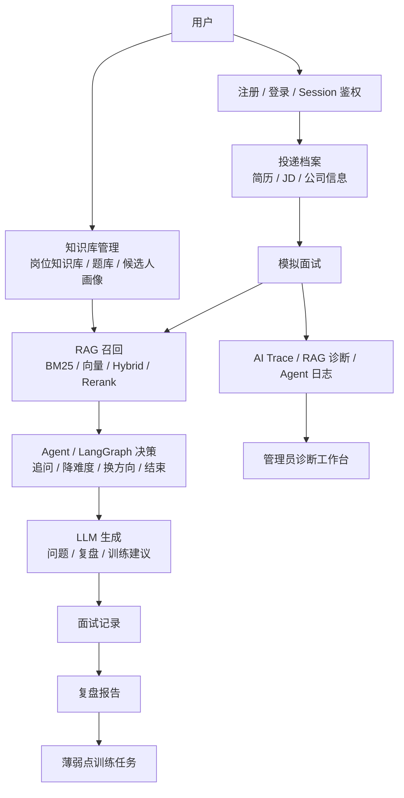
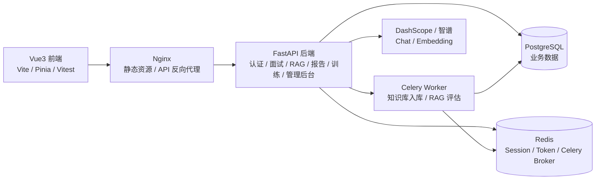

# AI 模拟面试训练系统

基于 **Vue3 + FastAPI + RAG + Agent/LangGraph** 的 AI 模拟面试训练系统。用户创建投递档案后，系统结合简历、岗位 JD、岗位知识库、题库和候选人画像生成面试问题；面试结束后自动生成复盘报告和薄弱点训练任务，管理员后台可查看 RAG 召回、Agent 决策和 AI 请求 trace。

## 在线演示

- 公网入口：`http://124.221.230.218:8080/vue/auth/login`
- 健康检查：`http://124.221.230.218:8080/api/health`
- GitHub 仓库：`https://github.com/davidluulc/ai-interview`

当前演示环境使用 IP + 8080 端口，暂未接入域名和 HTTPS。生产演示由 Docker Compose 编排 Nginx、FastAPI、PostgreSQL、Redis 和 Celery worker。

## 核心闭环

```text
创建投递档案
-> 维护简历 / JD / 公司信息
-> 上传或维护岗位知识库、题库、候选人画像
-> 开始模拟面试
-> RAG 召回相关资料
-> Agent 决策追问、降难度、换方向或结束
-> LLM 生成面试问题或复盘
-> 保存面试记录和复盘报告
-> 生成薄弱点训练任务
-> 后台查看 AI Trace、RAG 诊断和 Agent 日志
```

## 系统数据流



## 技术架构



## 核心功能

- **投递档案管理**：维护简历、岗位 JD、公司信息、岗位标签和归档状态。
- **AI 模拟面试**：基于档案、历史回答和 RAG 召回生成面试题，支持追问和复盘。
- **三类 RAG**：岗位知识库、题库、候选人画像分开维护，支持 BM25、向量检索、hybrid search、rerank、query rewrite 和命中日志。
- **Agent/LangGraph 编排**：构建 Agent State、Tool Calls、Agent Decision、policy、guardrail、fallback 和 nodeTrace。
- **复盘报告**：保存面试记录，生成逐题复盘、出题依据、薄弱点和训练计划。
- **薄弱点训练**：根据报告 weakTags 生成训练任务，提供专项练习、参考答案、纠正建议和下一步练习。
- **管理员诊断工作台**：按面试记录查看 RAG 命中、Agent 决策、AI 请求 trace、知识库健康和基础设施状态。
- **生产部署**：Docker Compose + Nginx + FastAPI + PostgreSQL + Redis + Celery worker，支持公网演示。

## 项目亮点

- **完整 AI 应用闭环**：不是单次聊天，而是从投递档案、面试、复盘到训练任务的持续改进链路。
- **RAG 工程化**：知识库、题库、候选人画像分层检索，并记录召回来源、命中数量、metadata 和质量诊断。
- **Agent 可观测性**：后台可查看 Agent 为什么追问、降难度、fallback 或结束复盘，减少 AI 黑箱。
- **生产化经验**：处理过 PostgreSQL 迁移、Nginx 502/504、模型额度耗尽、Embedding provider 切换、Docker 权限和 GitHub 拉取超时等问题。
- **可测试迭代**：后端 pytest 和前端 Vitest 覆盖认证、面试、报告、训练、知识库和后台管理等核心模块。

## 本地启动

后端：

```powershell
.\start-backend.cmd
```

Vue3 前端：

```powershell
.\start-vue-frontend.cmd
```

也可以查看本地开发提示：

```powershell
.\start-dev.cmd
```

常用本地地址：

- Vue3 前端：`http://127.0.0.1:5173/vue/app/interview`
- 管理员后台：`http://127.0.0.1:5173/vue/app/admin`
- 后端健康检查：`http://127.0.0.1:8000/api/health`
- FastAPI 文档：`http://127.0.0.1:8000/docs`

## 测试和构建

后端测试：

```powershell
python -m pytest -q
```

前端测试：

```powershell
cd frontend
npm.cmd run test
```

前端构建：

```powershell
cd frontend
npm.cmd run build
```

部署配置检查：

```powershell
docker compose --env-file .env.production.example config --quiet
```

## 生产部署摘要

生产演示环境使用 Docker Compose：

```text
Nginx -> FastAPI app -> PostgreSQL
                  -> Redis
                  -> Celery worker
```

部署时需要先构建 Vue3 前端，Nginx 会将 `frontend/dist` 挂载到 `/usr/share/nginx/html/vue`，并把 `/api/`、`/docs`、`/openapi.json` 代理给 FastAPI。

真实生产配置从 `.env.production.example` 复制为 `.env.production` 后填写。`.env.production` 只能放在服务器本地，不能提交到 GitHub。

详细部署入口：

- [部署总入口](docs/DEPLOYMENT.md)
- [VPS 部署 runbook](docs/deployment/vps-deploy-v1.md)
- [备份与回滚](docs/deployment/backup-and-rollback.md)
- [Nginx / Cloudflare / HTTPS](docs/deployment/nginx-cloudflare-https.md)

## 文档导航

- [当前项目状态](docs/PROJECT_STATUS.md)
- [数据模型与核心关系](docs/project-explanation/data-model.md)
- [部署总入口](docs/DEPLOYMENT.md)
- [排障总入口](docs/TROUBLESHOOTING.md)
- [公网演示材料](docs/demo/public-demo-materials.md)
- [项目总讲解](docs/project-explanation/ai-interview-system-overview.md)
- [面试深挖问答](docs/project-explanation/interview-deep-dive-qa.md)
- [文档总入口](docs/README.md)

## 目录结构

```text
backend_python/   FastAPI 后端、RAG、Agent、训练、管理后台接口
frontend/         当前主前端，Vue3 + Vite + Pinia
tests/            后端 pytest 测试
alembic/          数据库迁移脚本
deploy/           Nginx 等部署配置
docs/             项目文档、部署文档、演示资料、路线和讲解材料
scripts/          辅助脚本
data/             本地开发数据目录，真实数据库文件不提交
```

根目录 `index.html`、`app.js`、`styles.css` 是旧版原生前端兼容入口；当前主前端是 `frontend/` 下的 Vue3 应用。

## 当前边界

已完成公网 IP 演示、核心面试闭环、RAG seed、PostgreSQL/Redis/Celery/Nginx 容器编排和后台诊断工作台。当前尚未接入域名和 HTTPS，也未做对象存储、完整监控告警、数据库定时备份自动化和统一 trace id 全链路字段。

下一阶段更适合做展示材料、README、部署安全收口和少量演示数据优化，而不是继续无限加功能。项目真实状态以 [docs/roadmap/current-state.md](docs/roadmap/current-state.md) 为准。
