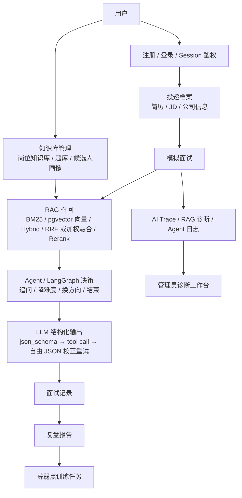
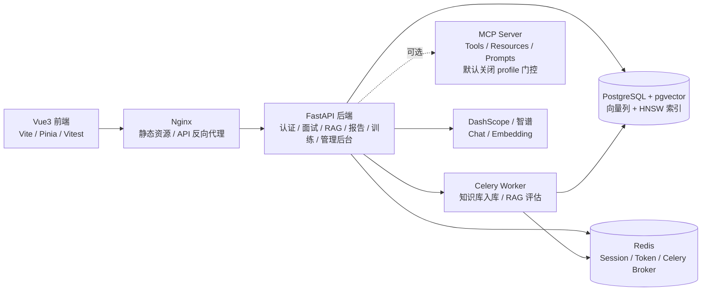

# AI 模拟面试训练系统

基于 **Vue3 + FastAPI + RAG + Agent/LangGraph + MCP** 的 AI 模拟面试训练系统。用户创建投递档案后，系统结合简历、岗位 JD、岗位知识库、题库和候选人画像生成面试问题；面试结束后自动生成复盘报告和薄弱点训练任务，管理员后台可查看 RAG 召回、Agent 决策和 AI 请求 trace。

## 在线演示

- 公网入口：`http://124.221.230.218:8080/vue/auth/login`
- 健康检查：`http://124.221.230.218:8080/api/health`
- GitHub 仓库：`https://github.com/davidluulc/ai-interview`

当前演示环境使用 IP + 8080 端口，暂未接入域名和 HTTPS。生产演示由 Docker Compose 编排 Nginx、FastAPI、PostgreSQL(pgvector)、Redis 和 Celery worker，可选启用 MCP 服务。

## 核心闭环

```text
创建投递档案
-> 维护简历 / JD / 公司信息
-> 上传或维护岗位知识库、题库、候选人画像
-> 开始模拟面试
-> RAG 召回相关资料（pgvector 向量检索 + BM25 混合，RRF 融合 + rerank）
-> Agent 决策追问、降难度、换方向或结束
-> LLM 结构化输出生成面试问题或复盘（三段降级链保障）
-> 保存面试记录和复盘报告
-> 生成薄弱点训练任务
-> 后台查看 AI Trace、RAG 诊断和 Agent 日志
```

## 系统数据流


```mermaid
flowchart TD
  U[用户] --> Auth[注册 / 登录 / Session 鉴权]
  Auth --> P[投递档案<br/>简历 / JD / 公司信息]
  U --> K[知识库管理<br/>岗位知识库 / 题库 / 候选人画像]
  P --> I[模拟面试]
  K --> R[RAG 召回<br/>BM25 / pgvector 向量 / Hybrid / RRF 或加权融合 / Rerank]
  I --> R
  R --> A[Agent / LangGraph 决策<br/>追问 / 降难度 / 换方向 / 结束]
  A --> L[LLM 结构化输出<br/>json_schema → tool call → 自由 JSON 校正重试]
  L --> H[面试记录]
  H --> Rep[复盘报告]
  Rep --> T[薄弱点训练任务]
  I --> Obs[AI Trace / RAG 诊断 / Agent 日志]
  Obs --> Admin[管理员诊断工作台]
```

## 技术架构


```mermaid
flowchart LR
  Browser[Vue3 前端<br/>Vite / Pinia / Vitest] --> Nginx[Nginx<br/>静态资源 / API 反向代理]
  Nginx --> API[FastAPI 后端<br/>认证 / 面试 / RAG / 报告 / 训练 / 管理后台]
  API --> PG[(PostgreSQL + pgvector<br/>向量列 + HNSW 索引)]
  API --> Redis[(Redis<br/>Session / Token / Celery Broker)]
  API --> Worker[Celery Worker<br/>知识库入库 / RAG 评估]
  Worker --> PG
  Worker --> Redis
  API -.可选.-> MCP[MCP Server<br/>Tools / Resources / Prompts<br/>默认关闭 profile 门控]
  API --> LLM[DashScope / 智谱<br/>Chat / Embedding]
```

### 生产架构总览图

[](https://raw.githack.com/davidluulc/ai-interview/main/docs/demo/ai-interview-arch.html)

> 上图为静态快照；**推荐点开[交互版](https://raw.githack.com/davidluulc/ai-interview/main/docs/demo/ai-interview-arch.html)**——支持明暗主题切换、缩放、关系高亮、三个导览视图（面试主链路 / RAG 检索链 / 异步与扩展）与 PNG/SVG 导出。图源规格：`docs/demo/ai-interview-arch.json`。

## 核心功能

- **投递档案管理**：维护简历、岗位 JD、公司信息、岗位标签和归档状态。
- **AI 模拟面试**：基于档案、历史回答和 RAG 召回生成面试题，支持追问和复盘。
- **三类 RAG**：岗位知识库、题库、候选人画像分开维护；BM25 + pgvector 向量检索（HNSW halfvec 索引召回 + SQL 内精确余弦重打分）+ Hybrid 融合（RRF / 加权可配置，默认 RRF，基于真实向量评测集对比实验选定）+ rerank + query rewrite + 命中日志。
- **结构化输出可靠性**：LLM 输出经三段降级链（json_schema 严格模式 → function calling 强制模式 → 自由 JSON + 校验失败定向重试），异常按传输/格式分层处理，失败自动降级并记录链路 trace，`LLM_STRUCTURED_OUTPUT=legacy` 一键回滚旧通道。
- **Agent/LangGraph 编排**：生产主线为固定流水线图（决策由规则策略 + LLM 双层给出）；`langgraph_agent_v3` 实验运行时已注册灰度——plan⇄tools 条件路由循环，模型自主选择检索工具与查询词，规则 guardrail 可覆盖模型建议，双保险步数上限。
- **MCP 服务（可选）**：官方 mcp SDK v2 实现，暴露 Tools（三检索/出题/复盘）、Resources（知识库目录）、Prompts（面试官/教练 persona），默认关闭，启用需 `--profile mcp`；客户端带内容清洗、超时与进程内回落。
- **复盘报告**：保存面试记录，生成逐题复盘、出题依据、薄弱点和训练计划。
- **薄弱点训练**：根据报告 weakTags 生成训练任务，提供专项练习、参考答案、纠正建议和下一步练习。
- **管理员诊断工作台**：按面试记录查看 RAG 命中、Agent 决策、AI 请求 trace、知识库健康和基础设施状态。
- **生产部署**：Docker Compose + Nginx + FastAPI + PostgreSQL(pgvector) + Redis + Celery worker，支持公网演示。

## 项目亮点

- **完整 AI 应用闭环**：不是单次聊天，而是从投递档案、面试、复盘到训练任务的持续改进链路。
- **RAG 工程化**：三层数据源分层检索；pgvector 两步检索（halfvec HNSW 索引召回 + 精确余弦重打分，规避 pgvector 2000 维索引上限）；融合策略不拍脑袋——用 38 例评测集对 BM25/向量/加权/RRF 四组跑 hit@3 与 MRR 对比，真实向量复跑后按数据切默认（见 [融合实验报告](docs/experiments/rag-fusion-comparison.md)）。
- **LLM 输出可靠性工程**：结构化输出三段降级链 + 异常分层 + 全链路 trace，生产默认开启、可环境变量整体回滚。
- **Agent 可观测性**：后台可查看 Agent 为什么追问、降难度、fallback 或结束复盘，减少 AI 黑箱；v3 实验图的条件路由、工具选择与规则覆盖均进 nodeTrace。
- **生产化经验**：处理过 PostgreSQL 迁移与维度统一重嵌、Nginx 502/504 与上游 DNS 缓存、模型 provider 切换、镜像构建源加速、Docker 权限和 GitHub 拉取超时等问题；数据库变更前双备份（pg_dump + 数据卷）。
- **可测试迭代**：后端 pytest（517+ 通过）和前端 Vitest 覆盖认证、面试、报告、训练、知识库、结构化输出、pgvector 检索一致性等核心模块。

## 本地启动

后端：

```powershell
.\start-backend.cmd
```

Vue3 前端：

```powershell
.\start-vue-frontend.cmd
```

也可以查看本地开发提示：

```powershell
.\start-dev.cmd
```

常用本地地址（后端起在 localhost:8000，前端 5173）：

- Vue3 前端：`http://127.0.0.1:5173/vue/app/interview`
- 管理员后台：`http://127.0.0.1:5173/vue/app/admin`
- 后端健康检查：`http://127.0.0.1:8000/api/health`（等价 `http://localhost:8000/api/health`）
- FastAPI 文档：`http://127.0.0.1:8000/docs`

## 测试和构建

后端测试：

```powershell
python -m pytest -q
```

前端测试：

```powershell
cd frontend
npm.cmd run test
```

前端构建：

```powershell
cd frontend
npm.cmd run build
```

部署配置检查：

```powershell
docker compose --env-file .env.production.example config --quiet
```

## 生产部署摘要

生产演示环境使用 Docker Compose：

```text
Nginx -> FastAPI app -> PostgreSQL (pgvector)
                  -> Redis
                  -> Celery worker
        （可选 --profile mcp）-> MCP Server
```

关键运行开关（详见 `.env.production.example`）：`VECTOR_SEARCH_BACKEND`（pgvector/sqlite）、`HYBRID_FUSION_MODE`（rrf/weighted）、`LLM_STRUCTURED_OUTPUT`（chain/legacy）、`MCP_TOOLS_ENABLED`（默认 false）。数据库结构变更走 Alembic 迁移 + 回填脚本，操作顺序见 [当前项目状态](docs/roadmap/current-state.md) 的部署待办。

部署时需要先构建 Vue3 前端，Nginx 会将 `frontend/dist` 挂载到 `/usr/share/nginx/html/vue`，并把 `/api/`、`/docs`、`/openapi.json` 代理给 FastAPI。重建 app 容器后需重启 nginx 刷新上游 DNS。

真实生产配置从 `.env.production.example` 复制为 `.env.production` 后填写。`.env.production` 只能放在服务器本地，不能提交到 GitHub。

详细部署入口：

- [部署总入口](docs/DEPLOYMENT.md)
- [VPS 部署 runbook](docs/deployment/vps-deploy-v1.md)
- [备份与回滚](docs/deployment/backup-and-rollback.md)
- [Nginx / Cloudflare / HTTPS](docs/deployment/nginx-cloudflare-https.md)

## 文档导航

- [当前项目状态](docs/roadmap/current-state.md)
- [生产架构总览图（交互版 HTML）](docs/demo/ai-interview-arch.html)
- [Agent v3 升级总纲（S1-S5 设计与验收）](docs/specs/active/agent-v3-upgrade-design.md)
- [数据模型与核心关系](docs/project-explanation/data-model.md)
- [部署总入口](docs/DEPLOYMENT.md)
- [排障总入口](docs/TROUBLESHOOTING.md)
- [公网演示材料](docs/demo/public-demo-materials.md)
- [项目总讲解](docs/project-explanation/ai-interview-system-overview.md)
- [面试深挖问答](docs/project-explanation/interview-deep-dive-qa.md)
- [文档总入口](docs/README.md)

## 目录结构

```text
backend_python/   FastAPI 后端、RAG、Agent、结构化输出、MCP 客户端、训练、管理后台接口
mcp_server/       可选 MCP Server（官方 SDK v2：Tools / Resources / Prompts）
frontend/         当前主前端，Vue3 + Vite + Pinia
tests/            后端 pytest 测试
alembic/          数据库迁移脚本
deploy/           Nginx 等部署配置
docs/             项目文档、部署文档、演示资料、路线和讲解材料
scripts/          辅助脚本（pgvector 测试库、回填、重嵌、融合实验、smoke）
data/             本地开发数据目录，真实数据库文件不提交
```

根目录 `index.html`、`app.js`、`styles.css` 是旧版原生前端兼容入口；当前主前端是 `frontend/` 下的 Vue3 应用。

## 当前边界

已完成公网 IP 演示、核心面试闭环、RAG seed、PostgreSQL(pgvector)/Redis/Celery/Nginx 容器编排、后台诊断工作台、结构化输出降级链与 RRF 融合（生产已启用）。尚未接入域名和 HTTPS；`langgraph_agent_v3` 实验运行时已注册但未接入路由层（待 shadow 观察后切换）；MCP 服务默认关闭（待租户隔离方案后启用）；统一 trace id 全链路字段、完整监控告警、数据库定时备份自动化留待后续阶段。

下一阶段更适合做展示材料、部署安全收口和少量演示数据优化，而不是继续无限加功能。项目真实状态以 [docs/roadmap/current-state.md](docs/roadmap/current-state.md) 为准。
