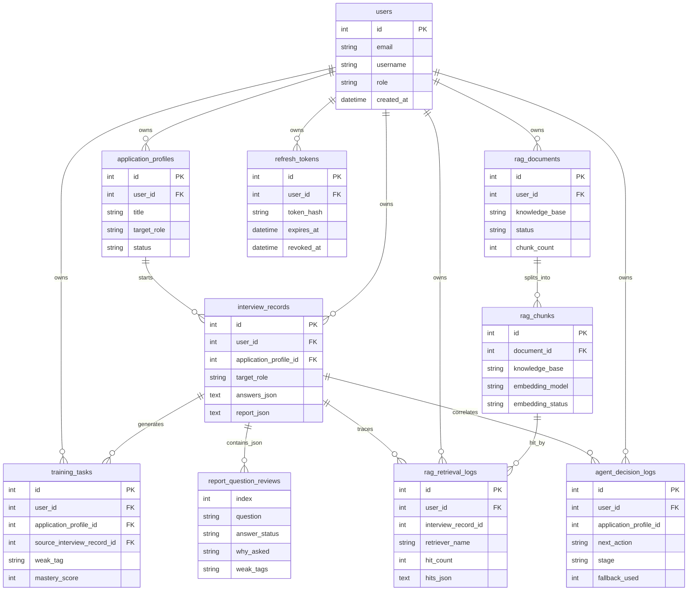

# 数据模型与核心关系

本文用于解释 AI 模拟面试训练系统的核心数据关系。它不是数据库字段大全，详细字段以 SQLAlchemy model 和 Alembic migration 为准。

## 核心 ER 图



说明：`report_question_reviews` 不是独立数据库表，而是 `interview_records.report_json` 中的 `questionReviews` 子结构。这里把它画出来，是为了让面试复盘的数据流更直观。

## 三条主线

### 1. 用户与面试闭环

```text
users
-> application_profiles
-> interview_records
-> report_json.questionReviews
-> training_tasks
```

用户先创建投递档案，档案保存简历、JD、公司信息和目标岗位。一次模拟面试会生成 `interview_records`，其中 `answers_json` 保存问答过程，`report_json` 保存复盘报告、逐题复盘、weakTags 和训练计划。报告中的薄弱点再沉淀为 `training_tasks`。

### 2. RAG 数据流

```text
users
-> rag_documents
-> rag_chunks
-> rag_retrieval_logs
```

RAG 文档按用户归属和知识库类型管理，例如岗位知识库、题库、候选人画像。文档入库后拆分成 chunk，并保存 embedding 模型和状态。面试或调试时，系统会把召回结果记录到 `rag_retrieval_logs`，用于后台诊断命中数量、召回来源和是否进入 prompt。

### 3. 可观测链路

```text
interview_records
-> rag_retrieval_logs
-> agent_decision_logs
-> AI debug detail
```

面试过程中的 RAG 命中和 Agent 决策会被记录下来。管理员后台按用户、档案、面试记录和轮次组织这些日志，帮助定位问题发生在知识库、召回、Agent 决策、LLM 生成还是前端展示。

## 设计取舍

- **多用户隔离**：核心业务表都带 `user_id`，接口查询时按当前用户过滤，避免跨用户数据泄露。
- **投递档案独立建模**：同一个用户可以针对不同岗位准备不同简历和 JD，面试记录关联到具体档案。
- **复盘 JSON 化**：逐题复盘目前存在 `report_json` 中，便于快速迭代报告结构；如果后续需要复杂筛选，可再拆成独立表。
- **RAG 文档和 chunk 分离**：文档负责生命周期、可见性和知识库类型，chunk 负责检索、embedding 和去重。
- **日志服务排障**：RAG 和 Agent 日志不是核心业务数据，但对解释“为什么这样问”和定位公网问题很重要。
- **Redis session 不进 SQL 表**：当前 session 状态由 Redis 承担，`refresh_tokens` 负责长期刷新令牌和撤销记录。
