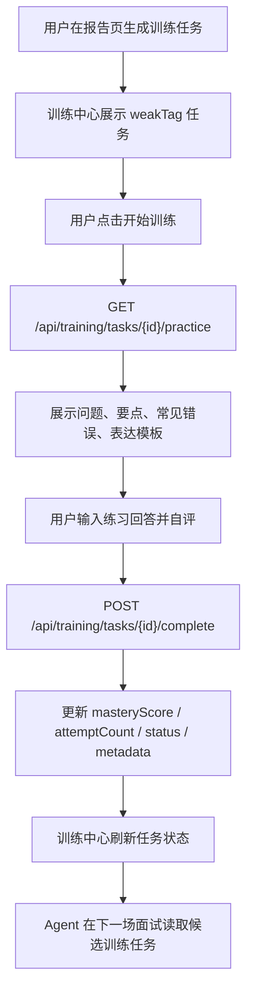

# 面试训练闭环增强 V3 设计文档

更新时间：2026-06-17

## 1. 背景

当前项目已经完成训练闭环的基础能力：

```text
面试报告 -> weakTags -> 训练任务 -> 训练中心 -> 开始 / 完成 / 归档
```

但现阶段的训练中心仍偏“任务列表 + 状态按钮”。用户能看到自己薄弱点是什么，也能把任务标记完成，但还没有真正进入一次“专项练习会话”：

- 用户不知道这一项具体该练哪道题。
- 用户不知道回答时应覆盖哪些要点。
- 用户不能在训练中心输入自己的练习回答。
- 用户完成训练时只点击按钮，缺少自评、反馈和掌握度变化解释。
- 训练任务虽然会被 Agent 读取，但用户侧对“练完如何影响下一场面试”的感知还不强。

因此，本阶段建设 **面试训练闭环增强 V3**。目标是把训练任务升级为可练、可答、可反馈、可更新掌握度的专项练习体验。

## 2. 阶段目标

本阶段形成下面的闭环：

```text
报告 weakTag
-> 生成训练任务
-> 进入专项练习
-> 查看练习题、回答要点、常见错误和一分钟表达模板
-> 用户输入练习回答
-> 用户选择回答状态：不会 / 模糊 / 完整
-> 后端更新 masteryScore、attemptCount、lastPracticedAt 和任务状态
-> 训练中心展示掌握度变化
-> 用户回到面试台再验证
```

具体目标：

1. 后端新增训练练习材料接口，基于 weakTag 模板返回练习题、回答要点、常见错误、表达模板和评分说明。
2. 后端增强完成训练接口，兼容接收 answerText、answerStatus 和 selfRating，并把最近练习摘要写入 task metadata。
3. 前端训练中心新增专项练习面板或轻量详情区。
4. 用户点击“开始训练”后，不只是改状态，还能看到练习题并输入回答。
5. 用户提交后能看到掌握度更新结果和下一步建议。
6. 保持现有训练任务列表、筛选、weakTag 聚合和来源报告跳转不被破坏。
7. 继续保持训练结果可被 Agent 读取，作为下一场面试的候选人画像信号。

## 3. 非目标

本阶段不做：

- 不新增复杂学习日历。
- 不做付费训练计划。
- 不做语音、视频、摄像头面试。
- 不接入新的大模型自动评分接口。
- 不重写 RAG、Agent、LangGraph 主链路。
- 不做 LangGraph checkpoint 持久化或 human-in-the-loop。
- 不做生产级 RAG 异步入库、OCR、Qdrant、pgvector。
- 不做 Docker / Nginx / VPS 真实上线。

## 4. 后端设计

### 4.1 训练练习材料

新增接口：

```text
GET /api/training/tasks/{task_id}/practice?mode=coach&difficulty=basic
```

返回结构：

```json
{
  "task": {},
  "practice": {
    "weakTag": "rag_quality",
    "weakLabel": "RAG 质量评估",
    "mode": "coach",
    "difficulty": "basic",
    "question": "Hit@K、MRR、关键词覆盖率分别解决什么问题？",
    "answerKeyPoints": ["Hit@K", "MRR", "关键词覆盖率", "命中日志"],
    "commonMistakes": ["只解释字段名，不解释指标用途"],
    "oneMinuteTemplate": "可以按指标定义、解决问题、项目落地、日志排查四步回答。",
    "rubric": [
      "是否讲清指标含义",
      "是否结合项目日志",
      "是否说明排查价值"
    ]
  }
}
```

实现原则：

- 基于现有 `weakness_training_templates.py`，不重新设计模板体系。
- 如果 weakTag 没有专属模板，使用现有 generic template。
- `mode` 只接受 `coach` 或 `interview`，非法值按 `coach` 处理。
- `difficulty` 只接受 `basic`、`medium`、`hard`，非法值按 `basic` 处理。
- 接口必须校验任务归属，用户只能读取自己的训练任务。

### 4.2 完成训练接口增强

现有接口：

```text
POST /api/training/tasks/{task_id}/complete
```

保持兼容，新增可选字段：

```json
{
  "answerStatus": "完整",
  "answerText": "我的练习回答正文",
  "selfRating": 4
}
```

更新逻辑：

- `answerStatus = 不会`：掌握度降低 5 分。
- `answerStatus = 模糊`：掌握度增加 8 分。
- `answerStatus = 完整`：掌握度增加 15 分。
- `masteryScore` 仍限制在 0 到 100。
- `attemptCount` 增加 1。
- `lastPracticedAt` 更新为当前时间。
- `masteryScore >= 80` 时任务状态为 `done`，否则为 `in_progress`。
- `metadata.lastPractice` 记录最近一次练习摘要：

```json
{
  "answerStatus": "完整",
  "answerPreview": "我的练习回答正文",
  "selfRating": 4,
  "completedAt": "2026-06-17T12:00:00"
}
```

`answerPreview` 只保存前 300 个字符，避免 metadata 变成大文本存储。

## 5. 前端设计

### 5.1 训练练习面板

新增组件：

```text
frontend/src/components/training/TrainingPracticePanel.vue
```

职责：

- 展示当前训练任务。
- 展示练习题。
- 展示回答要点、常见错误、一分钟表达模板。
- 提供回答输入框。
- 提供回答状态选择：不会 / 模糊 / 完整。
- 提供自评分：1 到 5。
- 提交后展示掌握度变化和状态变化。

交互原则：

- 默认不强迫用户写长答案，textarea 为空时也允许提交“不会”，用于真实学习场景。
- 如果选择“完整”，建议填写回答正文，但不阻断提交。
- coach 模式文案偏解释和引导。
- interview 模式文案偏简洁和压力训练。

### 5.2 Training Store 扩展

扩展：

```text
selectedTaskId
practiceLoading
practiceError
practiceDetail
practiceAnswerText
practiceAnswerStatus
selfRating
lastPracticeResult
```

新增 action：

```text
openPractice(taskId)
submitPractice()
resetPractice()
setPracticeAnswerText(text)
setPracticeAnswerStatus(status)
setSelfRating(rating)
```

`submitPractice()` 成功后必须替换任务列表中的对应 task，并更新 `lastPracticeResult`。

### 5.3 API Client 扩展

新增：

```text
getTrainingPractice(taskId, mode, difficulty)
completeTrainingTask(taskId, payload)
```

其中 `completeTrainingTask` 需要兼容旧调用：

```ts
completeTrainingTask(taskId, "完整")
```

也支持新调用：

```ts
completeTrainingTask(taskId, {
  answerStatus: "完整",
  answerText: "...",
  selfRating: 4
})
```

### 5.4 页面集成

`TrainingPage.vue` 保留现有训练中心布局，在任务列表下方或右侧展示练习面板。

建议交互：

```text
点击任务卡片的“开始训练”
-> 调用 startTask(taskId)
-> 调用 openPractice(taskId)
-> 页面显示专项练习面板
-> 用户输入回答并提交
-> submitPractice()
-> 更新列表、掌握度、尝试次数和结果提示
```

## 6. 数据流



## 7. 测试策略

本阶段继续测试驱动。

后端测试：

- `build_training_practice_payload` 能根据 weakTag 返回题目、要点、常见错误和模板。
- practice 接口只能读取当前用户自己的 task。
- complete 接口兼容旧 payload。
- complete 接口能保存 lastPractice metadata。
- answerText 很长时 answerPreview 被截断。

前端测试：

- API client 能请求 practice endpoint。
- training store 能打开练习、提交练习、更新 task。
- TrainingPracticePanel 能展示题目、要点和模板。
- TrainingPracticePanel 能输入回答、自评并提交。
- TrainingPage 点击开始训练后能打开练习面板。

验收命令：

```powershell
python -m pytest tests/test_training_tasks.py tests/test_training_practice_route.py -q
python -m pytest -q
cd frontend
npm.cmd run test -- src/api/training.test.ts src/stores/training.test.ts src/components/training/TrainingPracticePanel.test.ts src/pages/app/training-page.test.ts
npm.cmd run test
npm.cmd run build
```

浏览器验收：

```text
http://127.0.0.1:5173/vue/app/training
```

检查：

- 桌面端无横向溢出。
- 移动端 390px 无横向溢出。
- 点击开始训练后出现专项练习面板。
- 练习题、回答要点、常见错误、表达模板可见。
- 输入回答并提交后，掌握度和尝试次数更新。
- 页面不出现 `undefined`。

## 8. 面试表达目标

完成后可以这样讲：

```text
我的训练中心不是普通任务列表，而是把面试报告里的 weakTag 转成可执行的专项练习。
每个训练任务会根据 weakTag 读取训练模板，生成练习题、回答要点、常见错误和一分钟表达模板。
用户可以在前端输入练习回答，并用“不会、模糊、完整”做自评；后端根据自评更新 masteryScore、attemptCount 和任务状态。
这些训练结果又会被下一轮 Agent 面试读取，从而形成面试、复盘、训练、再面试的闭环。
```

## 9. 完成标准

- active plan 所有任务完成。
- 后端 practice endpoint 完成。
- complete endpoint 兼容旧调用并支持 answerText / selfRating。
- 前端训练练习面板完成。
- 训练任务提交后能更新掌握度和尝试次数。
- 聚焦后端测试通过。
- 后端全量测试通过。
- 聚焦前端测试通过。
- 前端全量测试通过。
- 前端 build 通过。
- 浏览器完成桌面端和移动端验证。
- `docs/roadmap/current-state.md` 更新。
- 完成后本 spec 和对应 plan 移动到 `completed/`。

