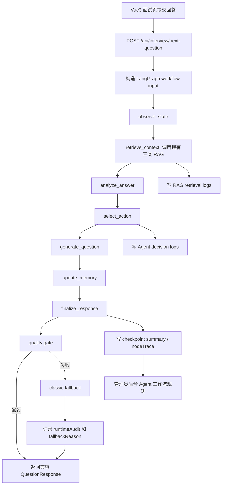

# LangGraph Mainline Consolidation V7：Agent 主链路收敛与工作流治理

更新时间：2026-06-17

## 1. 背景

AI 模拟面试系统目前已经具备比较完整的 Agent / RAG / 训练闭环 / 管理员后台能力。现有面试主接口仍然是：

```text
POST /api/interview/next-question
```

当前主链路以 classic Python Orchestrator 为默认稳定实现，LangGraph 已经完成 POC、旁路工作流、checkpoint summary、runtime governance、canary 灰度和后台 runtime 可观测性。这个阶段不能再继续停留在“classic 和 LangGraph 双轨对比”的展示状态，否则会显得像为了框架而框架，也会让系统表达变得臃肿。

本阶段目标是把 Agent 工作流从“双轨对比”收敛为“LangGraph 主链路 + classic fallback”。换句话说：

```text
LangGraph 负责默认主流程编排。
classic Agent 不再作为平级主流程展示，只作为 fallback/helper 保留。
前端和后台不再强调 classic vs LangGraph 对比，而是强调 Agent workflow observability。
```

这符合真实工程演进逻辑：先用轻量 Python 编排验证业务，再把稳定流程迁移到工作流框架，并保留 fallback、日志和审计能力保证迁移安全。

## 2. 本阶段目标

完成后，系统应具备：

1. `/api/interview/next-question` 默认内部执行 LangGraph 工作流。
2. 前端请求结构和响应结构保持兼容，普通用户不需要知道底层 runtime 已迁移。
3. classic Agent 退化为 fallback helper，只在 LangGraph 失败、输出不合规、quality gate 不通过或配置强制回退时使用。
4. LangGraph workflow state 能承载 profile、history、RAG hits、retrievalQuality、answerAnalysis、decision、generatedQuestion、memoryUpdate、runtimeAudit。
5. RAG 作为 LangGraph 的 `retrieve_context` 节点复用现有三类 RAG，不重写检索算法。
6. Agent 决策日志、RAG 命中日志、runtime audit、checkpoint summary 能继续写入和查询。
7. 管理员后台从“双轨对比”调整为“Agent 工作流观测”，展示节点轨迹、checkpoint、fallback、quality gate 和错误原因。
8. 用户端面试页保持轻量，只展示“为什么这样问”“下一步关注点”“是否使用兜底”等与训练体验相关的信息。
9. 测试覆盖默认 LangGraph、fallback、日志、RAG 兼容、响应兼容和前端观测文案。

## 3. 非目标

本阶段明确不做：

- 不重写 RAG 检索算法。
- 不改 BM25 / embedding / hybrid search / rerank 的核心逻辑。
- 不改 RAG 文档管理、摄取任务、RagIngestionTask 持久化链路。
- 不接 Qdrant / pgvector。
- 不做新的 OCR、Word、Excel、网页解析。
- 不新增另一个独立 Agent 项目。
- 不引入多 Agent 团队协作框架。
- 不做 Docker、Nginx、VPS、HTTPS 上线。
- 不重构整个 Vue3 前端。
- 不删除 classic Agent 代码；本阶段只把它从主链路降级为 fallback/helper。

## 4. 当前已有基础

### 4.1 classic Agent 能力

已存在：

- `backend_python/agent_state.py`
- `backend_python/agent_tools.py`
- `backend_python/agent_trace.py`
- `backend_python/agent_orchestrator.py`
- `backend_python/agent_policy.py`
- `backend_python/interview_agent.py`
- `backend_python/agent_logging.py`
- `backend_python/routes/interview.py`

这些模块已经沉淀了可复用能力：状态构造、RAG tool call、answer analysis、decision normalize、fallback、guardrail、nodeTrace、日志写入。

### 4.2 LangGraph 能力

已存在：

- `backend_python/langgraph_agent/`
- `backend_python/routes/langgraph_agent.py`
- `backend_python/agent_runtime.py`
- `backend_python/runtime_policy.py`
- `backend_python/runtime_audit.py`
- `backend_python/runtime_quality_gate.py`
- `backend_python/langgraph_agent/checkpoint_store.py`

LangGraph 已经可以执行节点链路、保存 checkpoint summary、支持 runtime audit，并能作为 canary runtime 被管理员选择。

### 4.3 RAG 能力

已存在：

- 三类 RAG：岗位知识库、题库、候选人画像。
- RAG 文档管理、metadata filter、query rewrite、hybrid search、rerank、evaluation case。
- RAG 命中日志。
- RAG 摄取任务持久化。

本阶段只调用这些能力，不重构这些能力。

## 5. 目标架构

### 5.1 主链路形态

目标链路：

```text
POST /api/interview/next-question
-> validate request and auth
-> build workflow input
-> run LangGraph mainline
   -> observe_state
   -> retrieve_context
   -> analyze_answer
   -> select_action
   -> generate_question
   -> update_memory
   -> finalize_response
-> quality gate
-> if failed: classic fallback
-> write RAG logs / Agent logs / runtime audit / checkpoint summary
-> return compatible QuestionResponse
```

接口仍然是原接口，前端不需要改请求路径。

### 5.2 Runtime 策略

本阶段后端 runtime 策略应收敛为：

```text
默认 runtime：langgraph_mainline
fallback runtime：classic
实验 runtime：保留配置入口，但不再作为产品主叙事
```

建议保留配置项：

```text
AGENT_RUNTIME_DEFAULT=langgraph_mainline
AGENT_RUNTIME_FALLBACK=classic
AGENT_RUNTIME_ALLOW_CLASSIC_DEBUG=true
```

如果配置缺失，本地开发默认使用 LangGraph mainline，并在失败时 fallback classic。

### 5.3 classic Agent 的新定位

classic Agent 不再是和 LangGraph 平级的主流程。它的新定位是：

- fallback helper。
- 单元测试中的稳定对照。
- 特定异常场景下的兜底生成器。
- 部分函数可被 LangGraph 节点复用，例如 answer analysis、policy、normalize、prompt assembly。

后台文案不应继续把 classic 和 LangGraph 并列成两个“产品路线”。

## 6. LangGraph State 设计

建议统一的 graph state 字段：

```text
profile: dict
history: list
lastAnswer: dict
roundCount: int
remainingRounds: int
agentMode: coach | interview
runtime: langgraph_mainline

roleHits: list
questionHits: list
memoryHits: list
retrievalQuality: dict

answerAnalysis: dict
policy: dict
decision: dict
generatedQuestion: dict
memoryUpdate: dict

nodeTrace: list
toolCalls: list
qualityGate: dict
fallback: dict
runtimeAudit: dict
checkpointSummary: dict
errors: list
```

字段原则：

- `state` 存事实和中间结果，不直接存前端展示文案。
- `decision` 存 Agent 对下一步动作的结构化判断。
- `generatedQuestion` 存最终自然语言问题。
- `runtimeAudit` 存本次实际用了哪个 runtime、是否 fallback、fallback 原因。
- `nodeTrace` 存节点执行轨迹，便于后台排查。

## 7. LangGraph 节点设计

### 7.1 observe_state

职责：

- 读取 profile、history、lastAnswer、roundCount、remainingRounds、agentMode。
- 生成当前局面事实快照。
- 不调用 LLM。
- 不做 RAG 检索。

输出：

```text
state.profile
state.history
state.lastAnswer
state.roundCount
state.remainingRounds
state.nodeTrace += observe_state
```

### 7.2 retrieve_context

职责：

- 调用现有三类 RAG。
- 复用现有 retrieval service、agent tools 或封装后的 adapter。
- 生成 roleHits、questionHits、memoryHits。
- 计算或复用 retrievalQuality。
- 继续写 RAG 命中日志。

不做：

- 不重写 BM25。
- 不重写 embedding。
- 不重写 hybrid search。
- 不重写 rerank。
- 不改 RAG 文档管理。

输出：

```text
state.roleHits
state.questionHits
state.memoryHits
state.retrievalQuality
state.toolCalls
state.nodeTrace += retrieve_context
```

### 7.3 analyze_answer

职责：

- 分析上一轮回答状态。
- 识别不会、偏弱、完整、跑题、过短、重复等状态。
- 复用现有 answer analysis 和 weakness strategy 逻辑。

输出：

```text
state.answerAnalysis
state.nodeTrace += analyze_answer
```

### 7.4 select_action

职责：

- 基于 state、retrievalQuality、answerAnalysis、agentMode、history 决定下一步动作。
- 复用 `agent_policy.py`、decision normalize 和 fallback decision 规则。
- 输出结构化 decision。

合法动作建议保持：

```text
deepen
lower_difficulty
raise_difficulty
shift_topic
explain
finish
```

输出：

```text
state.policy
state.decision
state.qualityGate
state.nodeTrace += select_action
```

### 7.5 generate_question

职责：

- 基于 state、decision、RAG context、history、profile 生成下一题。
- 调用现有 LLM question generation 逻辑或抽取后的 adapter。
- 保证返回结构兼容 `QuestionResponse`。

输出：

```text
state.generatedQuestion
state.nodeTrace += generate_question
```

### 7.6 update_memory

职责：

- 根据 decision 和回答状态生成候选人画像更新意图。
- 不在本阶段重写长期记忆系统。
- 可继续沿用当前 next-question 阶段的轻量 memory update 策略。

输出：

```text
state.memoryUpdate
state.nodeTrace += update_memory
```

### 7.7 finalize_response

职责：

- 汇总 generatedQuestion、decision、runtimeAudit、checkpointSummary。
- 生成兼容前端的最终响应。
- 确保缺失字段有默认值。

输出：

```text
QuestionResponse-compatible dict
```

## 8. Fallback 与 Quality Gate

### 8.1 触发 fallback 的条件

以下情况应触发 classic fallback：

- LangGraph 节点抛出异常。
- LangGraph 输出缺少必要字段。
- `generatedQuestion` 为空。
- `decision.nextAction` 非法。
- quality gate 判断问题不可用。
- checkpoint 写入失败且影响主流程完整性。
- 配置显式要求 fallback classic。

### 8.2 fallback 后仍要记录审计

fallback 不是静默发生，必须写入：

```text
runtimeAudit.requestedRuntime
runtimeAudit.visibleRuntime
runtimeAudit.fallbackUsed
runtimeAudit.fallbackReason
runtimeAudit.qualityGateReasons
```

管理员后台应能看到 fallback 发生在哪个节点、为什么发生。

### 8.3 不要求完全删除 classic

本阶段不能把 classic 直接删除。删除稳定兜底代码不是迁移成功的证明，稳定运行和可回滚才是。

## 9. RAG 接入边界

本阶段 RAG 只作为 LangGraph 节点中的工具或 adapter 被调用。

要做：

- `retrieve_context` 节点复用现有三类 RAG。
- 保持岗位知识库、题库、候选人画像 RAG 的召回逻辑不变。
- 保持 RAG 命中日志继续写入。
- 把 RAG hits 和 retrievalQuality 写入 LangGraph state。
- 后台工作流观测能看到 RAG 节点是否成功、命中数量、质量摘要。

不做：

- 不重写检索算法。
- 不改 hybrid search / rerank。
- 不改 RAG 文档管理。
- 不改 RAG 摄取任务。
- 不新增向量数据库。
- 不新增 RAG evaluation 指标体系。

本阶段可以新增 adapter 层，但 adapter 只负责把现有 RAG 调用包装成 LangGraph 节点可读的输入输出。

## 10. 后端接口兼容

### 10.1 `/api/interview/next-question`

必须保持：

- 请求路径不变。
- `QuestionRequest` 现有字段兼容。
- `QuestionResponse` 现有字段兼容。
- 前端旧字段仍能读取下一题文本、stage、focus、reason、agentDecision。

允许新增可选字段：

```text
runtimeAudit
workflowTrace
checkpointSummary
qualityGate
fallbackSummary
```

新增字段必须是可选字段，不能破坏旧前端和旧测试。

### 10.2 LangGraph 专用接口

已有 `/api/langgraph-agent/*` 接口可以保留给调试和测试，但产品主流程不再依赖用户手动访问这些接口。

如果保留：

- 文档中明确它们是 debug / compatibility API。
- 不再作为用户端主要入口宣传。

## 11. 日志与审计

本阶段日志目标：

1. RAG retrieval log 继续记录三类 RAG 命中。
2. Agent decision log 继续记录 nextAction、stage、difficulty、focus、reason、tools、state、decision、fallbackUsed。
3. Runtime audit 记录 LangGraph mainline 是否成功、是否 fallback classic。
4. Checkpoint summary 记录 threadId、currentNode、roundCount、lastAction、requiresHumanReview、qualityGate。
5. nodeTrace 记录每个 LangGraph 节点的开始、结束、错误和摘要。

日志不要求一次性设计成完整 APM 系统，但必须足够排查：

```text
为什么这次问这个问题？
RAG 有没有命中？
哪个节点决定追问或降难度？
LangGraph 有没有失败？
如果 fallback 了，为什么 fallback？
```

## 12. 前端页面改动范围

本阶段前端必须纳入 spec，但定位是“承接 LangGraph 主链路迁移结果”，不是全面重构 Vue3 应用。前端改动要服务两个目标：

```text
用户端：继续保持自然的面试体验，不暴露过多框架细节。
管理员端：把 LangGraph 工作流执行过程讲清楚，方便排查 Agent 为什么这样问。
```

### 12.1 前端 API 类型

需要更新：

```text
frontend/src/api/interview.ts
frontend/src/api/admin.ts
```

`NextQuestionResponse` 需要兼容后端新增的可选字段：

```text
runtimeAudit?: object
workflowTrace?: object | list
checkpointSummary?: object
qualityGate?: object
fallbackSummary?: object
```

要求：

- 所有新增字段都必须可选。
- 旧字段 `question`、`nextQuestion`、`agentDecision`、`decisionSummary` 等读取逻辑不能被破坏。
- 前端不得因为新增字段缺失而显示 `undefined`。

### 12.2 Pinia Store 承接

需要更新：

```text
frontend/src/stores/interview.ts
frontend/src/stores/admin.ts
```

`interview` store 应保存最近一次面试响应中的轻量 runtime 信息：

```text
lastRuntimeAudit
lastWorkflowTrace
lastCheckpointSummary
lastFallbackSummary
```

用途：

- 面试页展示“为什么这样问”和“是否使用兜底”。
- 不在用户端保存大段原始 JSON。

`admin` store 应加载并保存后台工作流观测数据：

```text
agentWorkflowSummary
agentWorkflowTrace
checkpointSummary
fallbackSummary
qualityGateSummary
```

这些字段可以来自已有 admin debug 接口，也可以来自后端新增/调整后的 admin payload。实现计划阶段再根据当前接口形态决定是扩展现有接口还是新增只读接口。

### 12.3 Vue3 面试页

需要更新：

```text
frontend/src/pages/app/InterviewPage.vue
frontend/src/components/interview/InterviewEvidencePanel.vue
```

用户端不应该显示“classic vs LangGraph 对比”，也不应该堆 LangGraph 原始术语。推荐展示为：

```text
为什么这样问
下一步关注点
本轮参考资料
系统兜底提示
```

展示规则：

- 如果 `agentDecision.reason` 存在，继续优先展示面试官追问原因。
- 如果 `runtimeAudit.fallbackUsed = true`，显示温和提示，例如“系统已使用稳定兜底策略保证面试继续”，不要显示异常堆栈。
- 如果 `workflowTrace` 存在，只展示摘要，例如“已完成状态观察、资料检索、回答分析、问题生成”，不要展示 node JSON。
- 普通用户端不显示 `threadId`、checkpoint raw JSON、quality gate raw JSON。

面试页保留：

- 学习辅导 / 真实面试模式。
- 当前档案横幅。
- 提问依据。
- 本题参考资料。

面试页移除或弱化：

- LangGraph 灰度实验开关的普通用户表达。
- classic / LangGraph 平级对比文案。
- 过于后台化的 runtime debug 说明。

### 12.4 Vue3 管理员后台

需要更新：

```text
frontend/src/pages/app/AdminPage.vue
frontend/src/api/admin.ts
frontend/src/stores/admin.ts
```

管理员后台应新增或改造一个主区块：

```text
Agent 工作流观测
```

该区块替代“Runtime 对比”作为主要表达。建议包含：

1. 工作流总览卡片
   - 当前 runtime：LangGraph mainline / classic fallback。
   - fallback 状态：正常 / 已兜底。
   - quality gate：通过 / 未通过。
   - checkpoint：已保存 / 未保存。

2. 节点轨迹列表
   - observe_state。
   - retrieve_context。
   - analyze_answer。
   - select_action。
   - generate_question。
   - update_memory。
   - finalize_response。

3. RAG 节点摘要
   - 岗位知识库命中数和质量等级。
   - 题库命中数和质量等级。
   - 候选人画像命中数和质量等级。
   - RAG 节点失败原因，如果存在。

4. fallback / quality gate 摘要
   - 是否触发 classic fallback。
   - fallback 原因。
   - quality gate 拦截原因。
   - 哪个节点触发了异常。

5. checkpoint 摘要
   - threadId。
   - currentNode。
   - roundCount。
   - lastAction。
   - requiresHumanReview。

6. 原始 JSON 折叠入口
   - 仅管理员可见。
   - 默认折叠。
   - 用于调试，不作为主要阅读方式。

管理员后台应清理或降级：

- “classic vs LangGraph 谁更好”的对比式表达。
- 面向普通用户的解释文案。
- 无实际诊断价值的占位说明。

### 12.5 前端导航与权限

本阶段不新增新页面路由，优先在现有页面承接：

```text
/vue/app/interview
/vue/app/admin
```

权限要求：

- 普通用户只能看到面试页轻量解释。
- 管理员才能看到 Agent 工作流观测。
- 普通用户不能通过前端入口看到 raw workflow JSON。

### 12.6 前端文案原则

用户端文案：

```text
少说 LangGraph，多说“为什么这样问”和“面试如何继续”。
```

管理员端文案：

```text
可以明确出现 LangGraph、workflow、checkpoint、fallback、quality gate，但必须解释这些字段用于排查什么问题。
```

禁止文案：

```text
双轨对比
实验链路更强
classic vs LangGraph 对比结果
```

推荐文案：

```text
Agent 工作流观测
本次工作流节点
资料检索节点
问题生成节点
稳定兜底
质量门禁
checkpoint 状态
```

### 12.7 前端测试

需要覆盖：

- `frontend/src/api/interview.ts` 能解析新增可选 runtime 字段。
- `frontend/src/stores/interview.ts` 能保存轻量 runtime 摘要。
- `frontend/src/pages/app/InterviewPage.vue` 在存在 fallback 时显示用户友好的兜底提示。
- `frontend/src/pages/app/InterviewPage.vue` 不展示 raw LangGraph JSON。
- `frontend/src/pages/app/AdminPage.vue` 显示“Agent 工作流观测”。
- 管理员后台显示节点轨迹、RAG 节点摘要、checkpoint 摘要、fallback 摘要。
- 管理员后台不再把 classic vs LangGraph 对比作为主标题或主卡片。
- 页面不出现 `undefined`。
- 桌面端和移动端无横向溢出。

## 13. 数据流



## 14. 测试策略

### 14.1 后端测试

必须覆盖：

- `/api/interview/next-question` 默认走 LangGraph mainline。
- LangGraph mainline 成功时返回兼容 `QuestionResponse`。
- LangGraph 节点异常时 fallback classic。
- LangGraph 输出不合法时 fallback classic。
- fallback 后 runtimeAudit 记录 fallbackUsed 和 fallbackReason。
- RAG 命中日志仍然写入。
- Agent decision log 仍然写入。
- checkpoint summary 能保存并查询。
- 普通用户请求不需要感知 runtime 变化。
- 不破坏现有三类 RAG 检索测试。

建议重点测试文件：

```text
tests/test_interview_agent_route.py
tests/test_langgraph_agent_graph.py
tests/test_langgraph_agent_graph_v2.py
tests/test_langgraph_agent_route.py
tests/test_langgraph_runtime_checkpoint_persistence.py
tests/test_rag_retrieval_logs.py
tests/test_admin_ai_debug.py
```

可新增：

```text
tests/test_langgraph_mainline_consolidation.py
tests/test_langgraph_mainline_fallback.py
```

### 14.2 前端测试

必须覆盖：

- `frontend/src/pages/app/interview-page.test.ts`
- `frontend/src/pages/app/admin-page.test.ts`
- `frontend/src/stores/interview.test.ts`
- `frontend/src/stores/admin.test.ts`

重点断言：

- 面试页仍能提交并展示下一题。
- 新增 runtime 字段不会破坏旧展示。
- 管理员后台显示“Agent 工作流观测”。
- 管理员后台不再把 classic vs LangGraph 当作主要产品表达。
- fallback / checkpoint / RAG 节点摘要可读。

### 14.3 全量验证

完成后必须运行：

```powershell
python -m pytest -q
cd frontend
npm.cmd run test
npm.cmd run build
```

浏览器验证：

```text
http://127.0.0.1:5173/vue/app/interview
http://127.0.0.1:5173/vue/app/admin
```

要求：

- 桌面端无 `undefined`。
- 移动端无横向溢出。
- 面试页可正常进入、提交回答、展示下一题。
- 管理员后台可看到 Agent 工作流观测、RAG 节点摘要、checkpoint、fallback 摘要。

## 15. 风险与取舍

### 15.1 风险：一次性替换主链路导致面试不可用

应对：

- 保留 classic fallback。
- 新增 quality gate。
- 测试覆盖失败回退。

### 15.2 风险：LangGraph state 过大，难以维护

应对：

- 明确 state 字段边界。
- 节点只写自己负责的字段。
- 后台展示摘要，原始 JSON 放折叠入口。

### 15.3 风险：前端变得过于技术化

应对：

- 用户端只展示训练相关解释。
- 管理员端展示工作流细节。
- 不把 LangGraph 名词堆给普通用户。

### 15.4 风险：RAG 被顺手重构导致范围失控

应对：

- RAG 只做 adapter。
- 禁止改检索核心算法。
- 保持现有 RAG 测试不变并全量回归。

## 16. 分阶段实施建议

虽然本阶段目标是“大步子”迁移主链路，但实现计划应拆成可验收步骤：

1. 补测试，锁定 `/api/interview/next-question` 默认 LangGraph mainline。
2. 梳理 LangGraph state 和节点输出，补齐缺失字段。
3. 把现有 RAG 调用接入 `retrieve_context` 节点。
4. 把 decision / policy / generate question 接入 LangGraph 主链路。
5. 加 quality gate 和 classic fallback。
6. 保持 Agent / RAG / runtime / checkpoint 日志写入。
7. 调整 Vue3 面试页和管理员后台文案。
8. 跑全量后端、前端测试和浏览器验证。
9. 更新路线文档并归档 spec/plan。

注意：这不是把目标拆小，而是把一个大迁移拆成可验证的工程步骤。

## 17. 面试表达目标

本阶段完成后，可以这样讲：

```text
我这个项目一开始用 Python 自研 Orchestrator 跑通 Agent 业务链路，核心是 state、tool calls、decision、fallback 和日志。业务流程稳定后，我把 /api/interview/next-question 的默认主链路迁移到了 LangGraph，用 StateGraph 把 observe_state、retrieve_context、analyze_answer、select_action、generate_question、update_memory 这些步骤节点化。迁移时我没有直接删除旧链路，而是把 classic Agent 降级为 fallback，配合 quality gate、runtime audit、checkpoint summary 和后台工作流观测，保证 LangGraph 出问题时系统仍然能返回可用问题，同时能排查具体失败节点。这体现的是 Agent 工作流治理能力，而不是单纯调用大模型。
```

## 18. 完成标准

- active plan 按本 spec 完成并归档。
- `/api/interview/next-question` 默认走 LangGraph mainline。
- classic Agent 只作为 fallback/helper 出现在主流程中。
- RAG 三类检索逻辑兼容，RAG 命中日志继续写入。
- Agent decision log、runtime audit、checkpoint summary 继续可观测。
- Vue3 面试页正常可用。
- Vue3 管理员后台展示 Agent 工作流观测。
- 不出现 classic vs LangGraph 平级对比式产品表达。
- 不引入本阶段非目标范围。
- `python -m pytest -q` 通过。
- `frontend` 下 `npm.cmd run test` 通过。
- `frontend` 下 `npm.cmd run build` 通过。
- 浏览器验证 `/vue/app/interview` 和 `/vue/app/admin` 桌面端、移动端无明显布局问题。
