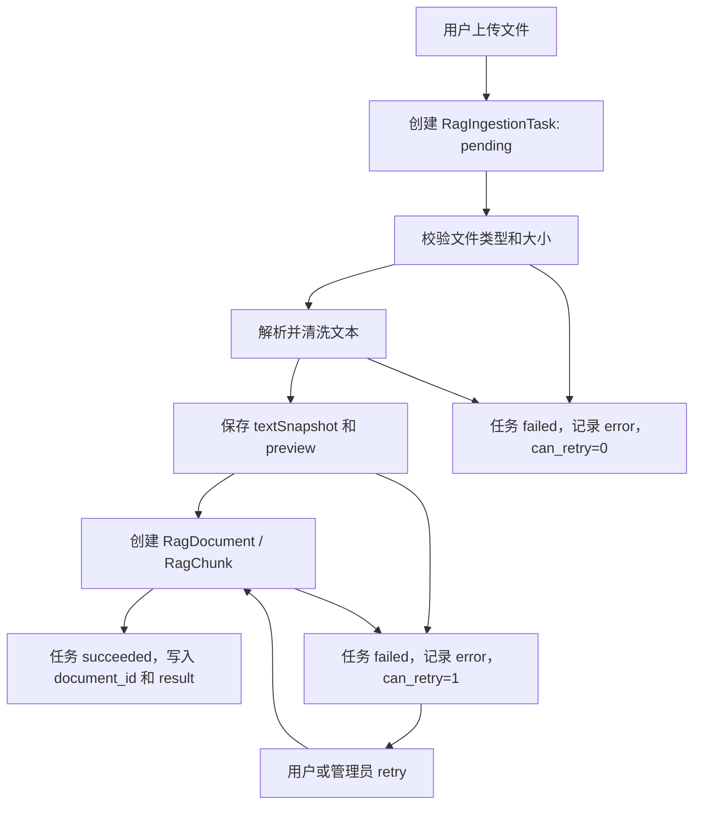

# Production RAG V3：摄取任务持久化、失败重试与质量监控增强

更新时间：2026-06-17

## 1. 背景

当前 AI 模拟面试系统的 RAG 已经不是最早的 demo 形态。项目已经落地了三类 RAG、文档生命周期、private / public 权限边界、metadata filter、query rewrite、hybrid search、rerank、RAG 命中日志、evaluation case、低质量召回面板、VectorStore 抽象，以及 `.txt` / `.md` / `.pdf` 文件导入入口。

但 RAG Document Ingestion V2 仍有一个生产化短板：

```text
文件导入任务状态仍然依赖内存态 task_status。
服务重启后任务记录会丢失。
失败原因不能长期追踪。
用户和管理员无法系统查看历史导入任务。
失败重试没有稳定入口。
```

本阶段目标是把 RAG 的“文档入口”从临时任务升级为可持久化、可审计、可重试、可在后台诊断的工程化链路。

## 2. 已有能力边界

本阶段不重复开发以下已经完成的能力：

- RAG 文档 CRUD。
- 文档 enabled / disabled / archived 生命周期。
- private / public 可见性。
- content hash / chunk hash / duplicate chunk 统计。
- metadata filter。
- query rewrite / multi-query。
- BM25 / embedding / hybrid search。
- rerank 和 rerank 解释。
- RAG evaluation case、Hit@K、MRR、关键词覆盖率。
- 管理员低质量召回面板。
- Vue3 知识库页面文件导入入口。

本阶段只补齐“摄取任务系统”与“后台质量监控”的生产化雏形。

## 3. 本阶段目标

完成后，系统应该具备：

1. RAG 文件导入任务写入数据库，不再只存在内存里。
2. 每个任务能记录创建人、知识库类型、文件名、状态、进度、失败原因、解析预览、生成文档 ID、重试次数。
3. 用户能查看自己的导入任务历史和当前任务状态。
4. 管理员能查看最近 RAG 摄取任务、失败任务和可重试任务。
5. 对于已经解析出文本但入库失败的任务，允许通过 retry 接口重新入库。
6. 后台 RAG 质量诊断不仅看“检索质量”，也能看到“文档入口质量”，例如解析失败、空文本、非法 metadata、入库失败。
7. 保持现有 `/api/rag/documents/upload` 返回结构兼容，现有 Vue3 知识库页面不被破坏。

## 4. 非目标

本阶段明确不做：

- 不做 OCR 图片识别。
- 不做 Word / Excel / 网页完整解析。
- 不接 Qdrant / pgvector。
- 不引入新的 LangGraph 能力。
- 不把 `/api/interview/next-question` 链路改成新的 RAG 实现。
- 不做真实 Redis / Celery 异步队列迁移。
- 不做对象存储。
- 不做 Docker、Nginx、VPS、HTTPS 上线。

本阶段可以为 Celery / Redis 预留任务状态字段，但不要求真实启动 worker。

## 5. 核心设计

### 5.1 数据库任务表

新增数据库模型：

```text
RagIngestionTask
```

建议字段：

```text
id: int
task_id: str
user_id: int
document_id: int | null
knowledge_base: str
title: str
original_filename: str
source_extension: str
status: pending / running / succeeded / failed
progress: int
message: str
error_message: str
retry_count: int
max_retries: int
can_retry: int
preview_json: str
result_json: str
input_json: str
created_at: datetime
updated_at: datetime
completed_at: datetime | null
```

`input_json` 用来保存可重试所需的最小输入快照：

```json
{
  "title": "FastAPI 面试知识",
  "knowledgeBase": "role",
  "visibility": "private",
  "metadata": {"positionTag": "python_backend"},
  "originalFilename": "fastapi.md",
  "textSnapshot": "已经清洗后的文本..."
}
```

说明：

- 如果失败发生在文本解析之前，没有 `textSnapshot`，则 `can_retry = 0`，用户需要重新上传文件。
- 如果失败发生在文本解析之后、入库之前，保留 `textSnapshot`，则 `can_retry = 1`。
- 当前上传文件大小限制为 5MB，保存清洗后文本快照在本地开发阶段可接受。未来如果接对象存储，可把 `textSnapshot` 替换为对象存储 key。

### 5.2 后端服务边界

新增服务模块：

```text
backend_python/rag_ingestion_tasks.py
```

职责：

- 创建持久化摄取任务。
- 更新任务状态、进度、消息、错误。
- 保存 preview / result / input snapshot。
- 判断任务是否可重试。
- 将任务序列化为接口响应。
- 执行 retry 时复用 `textSnapshot` 和原始 metadata。

现有 `backend_python/task_status.py` 保留给其他轻量任务使用，但 RAG ingestion 不再依赖它作为唯一任务状态来源。

### 5.3 接口设计

保持现有接口兼容：

```text
POST /api/rag/documents/upload
GET  /api/rag/documents/ingestion-tasks/{task_id}
```

新增接口：

```text
GET  /api/rag/documents/ingestion-tasks
POST /api/rag/documents/ingestion-tasks/{task_id}/retry
GET  /api/admin/rag/ingestion-tasks
```

用户侧任务列表只返回当前用户自己的任务。管理员接口返回最近任务，并包含用户邮箱。

retry 规则：

```text
只有任务 owner 或管理员可以重试。
只有 status=failed 且 can_retry=1 的任务可以重试。
retry_count 不能超过 max_retries。
重试时创建新的 RagDocument，成功后写回 document_id、result_json、status=succeeded。
不可重试时返回 409，并说明需要重新上传文件。
```

### 5.4 前端设计

Vue3 知识库页继续保留现有文件导入入口，并补充：

- 最近导入任务列表。
- 状态标签：pending / running / succeeded / failed。
- 失败原因。
- 文本长度、chunk 数。
- 可重试任务的“重试”按钮。
- 不可重试任务的“重新上传”提示。

管理员后台补充一个轻量的 “RAG 摄取任务监控” 区块：

- 最近任务列表。
- 失败任务数量。
- 可重试任务数量。
- 最近失败原因。
- 关联用户邮箱、知识库类型、文件名。

### 5.5 质量监控增强

现有 `admin_rag_quality` 主要关注检索阶段：

```text
empty_recall
weak_recall
unused_in_prompt
```

本阶段补充“摄取阶段质量”：

```text
parse_failed
empty_text
invalid_metadata
document_create_failed
retryable_failed_task
```

这不是替代 RAG 命中质量，而是补齐 RAG 工程链路的入口可观测性：

```text
文档没进来，后面检索再强也召回不到。
```

## 6. 数据流



## 7. 测试策略

后端优先测试：

- 上传成功后数据库中存在 `RagIngestionTask`。
- 查询任务接口在服务重启模拟后仍可从数据库读到任务。
- 上传失败时任务记录保留失败原因。
- 非 owner 不能查看或重试别人的任务。
- `textSnapshot` 存在且 `can_retry=1` 时可以重试。
- 超过最大重试次数时返回 409。
- 管理员接口能看到最近任务和失败摘要。

前端测试：

- 知识库页能展示最近导入任务。
- 失败任务能展示错误原因。
- 可重试任务显示重试按钮。
- 管理员后台显示 RAG 摄取任务监控区块。

全量验证：

```powershell
python -m pytest -q
cd frontend
npm.cmd run test
npm.cmd run build
```

并使用内置浏览器验证：

```text
http://127.0.0.1:5173/vue/app/knowledge
http://127.0.0.1:5173/vue/app/admin
```

桌面端和移动端不应出现横向溢出、undefined、空白区块。

## 8. 面试表达目标

本阶段完成后，可以这样讲：

```text
我的 RAG 不只是支持文件上传，还把文档摄取过程任务化和持久化了。用户上传文件后，系统会创建 RagIngestionTask，记录解析、清洗、chunk 预览、入库、失败原因和重试次数。对于已经解析出文本但入库失败的任务，可以复用 text snapshot 做 retry；如果失败发生在解析前，则明确提示重新上传。管理员后台可以看到最近摄取任务和失败原因，这样 RAG 的入口链路也具备可观测性，避免知识库没入库却只在检索阶段排查问题。
```

## 9. 完成标准

- active plan 所有任务完成。
- 后端和前端测试通过。
- `POST /api/rag/documents/upload` 保持兼容。
- 新增任务列表、任务详情、任务重试接口可用。
- Vue3 知识库页可查看最近导入任务。
- 管理员后台可查看 RAG 摄取任务监控。
- 文档完成后移动到 completed。
- `docs/roadmap/current-state.md`、`docs/specs/README.md`、`docs/plans/README.md` 更新。
