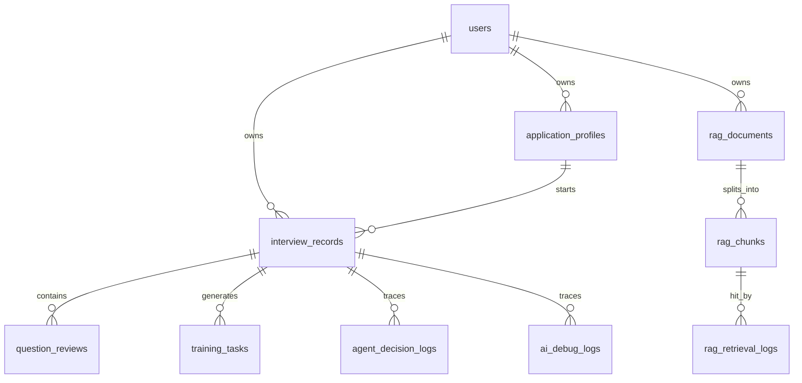

# Repository Showcase Cleanup V1 Design

## 背景

AI 模拟面试系统已经完成公网部署、核心面试闭环、RAG/Agent 可观测、训练页体验修正和生产环境排障。当前阶段的主要目标不再是继续堆功能，而是把项目整理成一个能被 HR 快速理解、能被技术面试官深入追问、也能被自己稳定讲清楚的作品。

现有仓库已经包含 README、部署文档、路线文档、演示资料和项目讲解材料，但信息入口偏开发过程视角。公开 GitHub 仓库需要展示“项目本身”，而 BOSS 项目描述、简历 bullet、面试讲解稿等求职包装材料不适合公开，应放在仓库外的本地私有目录。

本轮做一次性仓库展示整理，覆盖 P0 仓库门面、P1 私有求职材料和 P2 安全小清理。原则是：能提升展示可信度和可维护性的整理一次完成；可能破坏部署、引入功能回归或需要重新验证业务链路的大重构不做。

## 目标

1. 让 GitHub README 更像项目主页：一句话说明、在线演示、核心功能闭环、技术架构、系统数据流、项目亮点、本地启动、生产部署和文档导航。
2. 新增或整理公开工程文档，使技术面试官能看懂系统架构、数据流和生产部署边界。
3. 在仓库外维护求职包装材料，服务 BOSS 在线简历、附件简历和面试表达，但不推送到 public GitHub。
4. 明确仓库中哪些旧文件暂时保留，避免为了“整理”误删兼容入口或破坏部署。
5. 做一次安全的小幅目录卫生检查：脚本、部署配置、环境变量样例、临时文件和敏感信息边界。

## 非目标

1. 不重构后端 `backend_python/`、前端 `frontend/`、测试 `tests/` 的代码目录。
2. 不删除根目录旧版 `index.html`、`app.js`、`styles.css`，除非本轮能明确证明它们不被生产部署、README、启动脚本或兼容入口引用；如果不能证明，只在 README 中标注为旧版兼容入口。
3. 不把 BOSS 项目描述、简历 bullet、面试背诵稿、私有求职策略提交到 GitHub。
4. 不新增复杂功能，不调整数据库表结构，不改生产部署逻辑。
5. 不把本地 `.env`、`.env.production`、API key、服务器密码、个人简历原文等敏感信息写入公开文档。

## 一次性执行范围

### P0：仓库门面整理

本轮一次性完成：

1. 重写根目录 `README.md`，让它成为公开 GitHub 项目主页。
2. 新增或补齐公开项目状态文档：
   - 优先复用 `docs/roadmap/current-state.md` 作为真实状态入口。
   - 如需要短入口，可新增 `docs/PROJECT_STATUS.md`，内容指向并摘要 `docs/roadmap/current-state.md`。
3. 新增或补齐公开部署入口：
   - 优先复用 `docs/deployment/`。
   - 如需要短入口，可新增 `docs/DEPLOYMENT.md`，内容指向 `docs/deployment/vps-deploy-v1.md`、`troubleshooting.md`、`backup-and-rollback.md`。
4. 新增或补齐公开排障入口：
   - 优先复用 `docs/deployment/troubleshooting.md`。
   - 如需要短入口，可新增 `docs/TROUBLESHOOTING.md`，内容指向详细排障文档。
5. 新增 `docs/project-explanation/data-model.md`，用简洁图说明核心数据关系和业务流转。

### P1：私有求职材料整理

本轮一次性在仓库外目录维护：

```text
C:\Users\Sharknro\Documents\求职材料\AI模拟面试系统\
```

建议文件：

1. `boss-project-description.md`
2. `resume-bullets.md`
3. `interview-script.md`
4. `interview-qa-private.md`
5. `project-packaging-notes.md`

这些文件不提交 GitHub，不出现在仓库 `git status` 中。

### P2：安全小清理

本轮只做低风险整理：

1. 检查 `.gitignore` 是否覆盖本地环境文件、日志、缓存、构建产物和私有材料。
2. 检查 `.env` 是否已被 Git 跟踪；如已跟踪，不在本轮直接删除历史，只给出风险说明和后续处理建议。
3. 检查根目录旧入口和启动脚本是否仍被文档或部署引用：
   - 能证明废弃且安全时，移动或删除前先列入计划并确认。
   - 不能证明时保留，并在 README 解释当前主前端是 `frontend/`。
4. 检查 `scripts/`、`deploy/` 是否已有合理归属；不为了好看强行移动文件。
5. 不碰 `.git/`、数据库数据、生产环境文件和用户本地私有材料。

## 公开仓库整理范围

### README.md

README 调整为 GitHub 首页视角，建议结构：

1. 项目名称和一句话介绍
2. 在线演示与当前部署状态
3. 核心业务闭环
4. 系统数据流图
5. 技术架构
6. 项目亮点
7. 本地启动
8. 测试和构建
9. 生产部署摘要
10. 文档导航
11. 当前边界与后续规划
12. 目录结构说明

README 中可以放简洁 Mermaid 数据流图，但不放过于复杂的完整 ER 图。

### docs/project-explanation/data-model.md

新增公开数据模型说明，服务技术面试官深入追问。内容包括：

- 核心实体关系图：用户、投递档案、面试记录、复盘报告、逐题复盘、训练任务、RAG 文档、RAG chunk、RAG 命中日志、Agent 决策日志、AI debug 日志、session/refresh token。
- 关键数据流说明：投递档案如何进入面试，面试如何沉淀报告，报告如何生成训练任务，RAG/Agent/LLM trace 如何服务后台排查。
- 只解释核心关系，不追求覆盖所有数据库字段。

ER 图详细添加方式：

1. README 只放“系统数据流图”和“简化技术架构图”，不放完整 ER 图。
2. 完整核心 ER 图放在 `docs/project-explanation/data-model.md`，使用 Mermaid `erDiagram`，方便 GitHub 直接渲染。
3. ER 图只覆盖面试官容易追问的核心业务表，不把 Alembic、内部缓存、临时任务字段和所有 debug 细节都塞进去。
4. ER 图分成三条主线解释：
   - 用户主线：`users -> application_profiles -> interview_records -> question_reviews -> training_tasks`
   - RAG 主线：`users -> rag_documents -> rag_chunks -> rag_retrieval_logs`
   - 可观测主线：`interview_records -> agent_decision_logs / ai_debug_logs / rag_retrieval_logs`
5. 每张表只列 3-6 个关键字段，优先列主键、外键、业务含义字段和排障关键字段。
6. ER 图下方补“为什么这样设计”的说明，重点解释多用户数据隔离、面试闭环沉淀、RAG chunk 与召回日志、AI trace 与 Agent 决策日志之间的关系。
7. 不把 ER 图写成数据库字段大全；详细字段以 SQLAlchemy model 和 Alembic migration 为准。

推荐 Mermaid 结构：



### docs/PROJECT_STATUS.md 与 docs/roadmap/current-state.md

`docs/roadmap/current-state.md` 保留为项目真实状态入口。`docs/PROJECT_STATUS.md` 如新增，只作为短摘要入口，避免和 current-state 重复维护。

可补充“展示整理阶段”说明：

- 当前项目已适合进行公网演示和简历投递包装。
- 后续优先做文档、演示数据、README 和部署安全收口。
- 更底层的 trace id 统一、复杂筛选和监控告警可进入后续版本。

### docs/DEPLOYMENT.md 与 docs/deployment/

`docs/DEPLOYMENT.md` 如新增，只做部署总入口：

- 本地开发怎么启动。
- VPS Docker Compose 部署看哪份文档。
- Nginx、PostgreSQL、Redis、Celery 分别在哪里配置。
- 生产 `.env.production` 不提交 GitHub。
- 后续 HTTPS、备份、回滚看哪些详细文档。

### docs/TROUBLESHOOTING.md 与 docs/deployment/troubleshooting.md

`docs/TROUBLESHOOTING.md` 如新增，只做排障总入口，详细内容仍放 `docs/deployment/troubleshooting.md`。

`docs/deployment/troubleshooting.md` 保留为公开工程排障复盘。只保留能体现工程判断、系统性排查和生产化经验的问题，不写无含金量的小问题或纯操作失误。

适合写入：

- GitHub clone/fetch 在 VPS 上 TLS 超时。
- Docker daemon 权限问题。
- PostgreSQL 生产迁移字段缺失。
- Nginx 502/504 与后端启动、LLM 慢请求的区别。
- DashScope embedding 额度耗尽与智谱 embedding-3 切换。
- Vue 新旧入口混淆。

公开写法应是工程复盘，不写成“面试怎么回答”。

不建议写入：

- 纯粘贴命令导致的终端显示不全。
- 临时记错路径、命令少打参数这类低价值操作问题。
- 只和个人账号、平台控制台使用习惯有关的问题。
- 不能抽象成工程经验的问题。

排障条目建议统一格式：

```text
问题现象：
影响范围：
定位过程：
根因：
修复方式：
沉淀经验：
```

其中“沉淀经验”要落到可迁移能力，例如：如何区分前端错误、Nginx 代理错误和后端慢请求；为什么生产数据库迁移必须和代码版本同步；为什么 embedding provider 切换后需要重新入库或做模型隔离。

## 私有求职材料范围

私有目录：

```text
C:\Users\Sharknro\Documents\求职材料\AI模拟面试系统\
```

建议维护：

```text
boss-project-description.md
resume-bullets.md
interview-script.md
interview-qa-private.md
project-packaging-notes.md
```

这些材料用于讨论如何包装项目，不提交 GitHub。内容可以包括：

- BOSS 在线简历项目描述
- Python 后端版本简历 bullet
- AI 应用开发版本简历 bullet
- 1 分钟项目介绍
- 3 分钟架构讲解
- 常见追问和回答思路
- 针对不同岗位的表达取舍

### 私有材料建议内容

`boss-project-description.md`：

- BOSS 项目名称、项目角色、项目链接。
- 项目描述、项目职责、项目业绩三段版本。
- 偏 Python 后端、偏 AI 应用、偏全栈三种措辞。

`resume-bullets.md`：

- 附件简历中可使用的 4-6 条 bullet。
- 每条 bullet 尽量体现“问题、动作、结果”，不只列技术栈。

`interview-script.md`：

- 1 分钟项目介绍。
- 3 分钟架构讲解。
- 生产部署和排障复盘讲法。

`interview-qa-private.md`：

- 面试官可能追问的问题。
- 回答思路，而不是死记硬背稿。

`project-packaging-notes.md`：

- 当前投递岗位取舍。
- 哪些点公开讲，哪些点谨慎讲。

## 公开与私有边界

可以公开：

- 项目架构
- 数据流
- 部署说明
- 排障复盘
- 技术亮点
- 演示数据说明
- 当前状态和 roadmap

不建议公开：

- BOSS 项目描述成稿
- 简历 bullet 多版本
- 面试背诵稿
- 面试问答题库
- 求职策略和岗位匹配策略

判断标准：

```text
别人看到后觉得这是项目说明，可以公开。
别人看到后觉得这是求职话术，不公开。
```

## 验收标准

1. README 打开后 1 分钟内能看懂项目定位、核心链路和技术栈。
2. README 能链接到数据模型、部署、排障、项目状态等深度文档。
3. `docs/project-explanation/data-model.md` 能用一张简洁图说明核心数据关系和流转。
4. 私有求职材料目录存在，且求职包装材料不进入 GitHub diff。
5. `git status` 中不包含私有求职材料。
6. `docs/PROJECT_STATUS.md`、`docs/DEPLOYMENT.md`、`docs/TROUBLESHOOTING.md` 如新增，不复制大量旧文档，而是作为短入口链接到详细文档。
7. `.gitignore` 覆盖常见本地环境文件、日志、缓存和构建产物。
8. 不破坏现有测试、构建和部署文件。
9. 如果只改文档和 ignore，可用 `git diff --check`、文档阅读检查和 `git status` 验证；如改到可执行脚本或配置，再跑对应配置检查。
