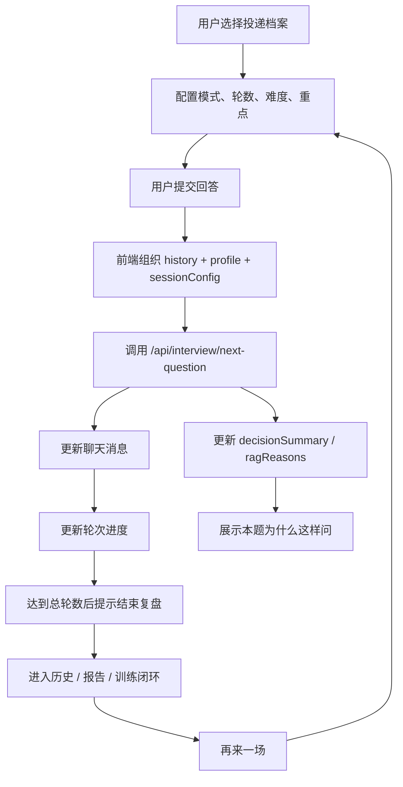

# Interview Workbench Experience V4 设计文档

更新时间：2026-06-13

## 1. 背景

当前 AI 模拟面试系统已经具备较多底层能力：

- 用户注册、登录、投递档案和历史复盘。
- 岗位知识库 RAG、题库 RAG、候选人画像 RAG。
- RAG 文档管理、文件导入、metadata、hybrid search、rerank、命中日志和质量评估。
- Interview Orchestrator Agent，包含 coach / interview 双模式、fallback、重复问题保护、topic shift 和决策日志。
- LangGraph 旁路实验、checkpoint summary、interrupt / resume 和 runtime 灰度策略。
- Vue3 用户工作台、知识库页、训练中心、报告页和管理员后台。

但当前面试页仍然偏“聊天框 + 解释面板”。用户可以回答问题，却不太清楚：

- 面试前：这场训练的轮数、难度和重点是什么。
- 面试中：现在是第几题、当前考察方向是什么、为什么系统这样问。
- 面试后：如何从报告自然进入专项训练，再开始下一场练习。

因此，本阶段目标不是继续堆 RAG、Agent、LangGraph 的底层能力，而是把已有能力串成更完整的 **面试训练产品闭环**。

## 2. 本阶段目标

本阶段建设 **Interview Workbench Experience V4**，让 Vue3 面试主流程形成更清晰的体验链路：

```text
选择投递档案
-> 配置本次面试
-> 面试问答与进度反馈
-> 理解本题为什么这样问
-> 结束并进入复盘
-> 根据报告生成训练任务
-> 再来一场
```

具体目标：

1. 在 Vue3 面试页增加“本次面试配置区”。
2. 支持本次面试轮数、难度、重点方向和模式的前端配置。
3. 在面试页显示当前轮次进度。
4. 在面试页保留当前档案摘要、岗位目标、公司信息和 JD 摘要。
5. 把 Agent 决策摘要和 RAG 参考资料表达成用户能理解的“本题为什么这样问”。
6. 增加“结束并复盘”入口，让用户知道一次训练可以收束。
7. 强化报告页“下一步训练”区域，让 weakTag、训练任务和训练中心跳转更清楚。
8. 增加“再来一场”入口，让用户从报告回到面试页。
9. 新增中文学习文档，解释 AI 应用产品闭环以及面试时如何讲这部分。

## 3. 非目标

本阶段不做以下内容：

- 不重写 `/api/interview/next-question`。
- 不修改后端 RAG 检索链路。
- 不修改 Agent 决策链路。
- 不升级 LangGraph，不安装 LangChain。
- 不做 Redis / Celery / PostgreSQL 生产化。
- 不做 Docker / Nginx / VPS 上线。
- 不做全站 UI 彻底重构。
- 不做音视频面试、语音识别、摄像头能力。
- 不新增支付、多租户、企业空间等商业化功能。

## 4. 用户体验设计

### 4.1 面试前配置区

当用户已经选择当前投递档案后，面试页顶部展示本次训练配置：

- 当前档案名称。
- 目标岗位。
- 公司信息。
- JD 摘要。
- 模式：学习辅导 / 真实面试。
- 轮数：默认 8，可选 5 / 8 / 10。
- 难度：基础 / 标准 / 压力。
- 重点方向：项目深挖 / 技术基础 / RAG & Agent / 行为面试 / 综合。

这些配置先作为前端状态和请求上下文的一部分，不要求后端新增数据库表。提交下一题时，可以把配置放进 `profile.sessionConfig` 中，让后端模型调用有机会参考，但保持接口结构兼容。

### 4.2 面试中进度反馈

聊天区上方展示紧凑进度条：

```text
第 3 / 8 题
模式：学习辅导
难度：标准
重点：RAG & Agent
```

进度来自前端回答历史：

```text
currentRound = min(answeredHistory.length + 1, totalRounds)
isSessionComplete = answeredHistory.length >= totalRounds
canFinish = answeredHistory.length > 0
```

当达到总轮数后，页面不再鼓励无限继续追问，而是提示用户结束并进入复盘。

### 4.3 本题为什么这样问

继续复用已有 `InterviewEvidencePanel` 的解释能力，但表达要更像产品文案：

- 为什么这样问。
- 参考了哪些资料。
- 本题主要考察什么。
- 如果答不上来，可以先从哪个方向组织。

学习辅导模式可以解释得更充分；真实面试模式应保持克制，避免让用户感觉系统把答案直接喂出来。

### 4.4 结束并复盘

面试页新增“结束并复盘”提示区：

- 未完成任何回答时，提示至少完成 1 轮问答后再复盘。
- 完成至少 1 轮问答后，允许用户进入历史 / 报告链路。
- 达到设置轮数后，突出显示“本轮面试可以复盘了”。

本阶段优先做前端入口和状态表达。若当前场次尚未生成可直接跳转的报告 ID，则先跳转到 `/vue/app/history`，让用户从历史记录进入报告。

### 4.5 报告页训练闭环

报告页已有总分、薄弱点、逐题复盘、训练任务生成和训练中心入口。本阶段增强表达：

- 将“薄弱点”升级为“建议优先训练”。
- 展示本次建议优先训练的方向。
- 生成训练任务后明确提示下一步。
- 新增“再来一场”按钮，跳转到 `/vue/app/interview`。

## 5. 前端架构设计

本阶段以小组件方式增强，不把所有逻辑继续堆进 `InterviewPage.vue`。

新增组件：

```text
frontend/src/components/interview/InterviewSessionSetup.vue
frontend/src/components/interview/InterviewProgressStrip.vue
frontend/src/components/interview/InterviewFinishPanel.vue
```

继续复用组件：

```text
frontend/src/components/interview/CurrentProfileBanner.vue
frontend/src/components/interview/InterviewModeSwitch.vue
frontend/src/components/interview/InterviewChatPanel.vue
frontend/src/components/interview/InterviewEvidencePanel.vue
```

更新 store：

```text
frontend/src/stores/interview.ts
```

新增状态：

```text
sessionConfig.totalRounds
sessionConfig.difficulty
sessionConfig.focusArea
currentRound
isSessionComplete
canFinish
answeredHistory 对外暴露
```

新增 action：

```text
updateSessionConfig()
resetSession()
```

## 6. 数据流



## 7. 测试策略

本阶段遵循前端 TDD：

1. 先写或更新 Vitest 测试。
2. 运行测试确认失败原因符合预期。
3. 再实现组件或 store。
4. 重新运行聚焦测试。
5. 最后运行全量前端测试和 build。

需要覆盖：

- `interview store` 能维护 sessionConfig、currentRound、isSessionComplete、canFinish、resetSession。
- `InterviewSessionSetup` 能展示档案摘要并发出配置更新事件。
- `InterviewProgressStrip` 能展示轮次、模式、难度和重点。
- `InterviewFinishPanel` 能区分不可复盘、可复盘、建议复盘三种状态。
- `InterviewPage` 能串起配置区、进度条、聊天区、解释区和结束复盘入口。
- `ReportPage` 能展示“建议优先训练”和“再来一场”入口。

验收命令：

```powershell
cd frontend
npm.cmd run test -- src/stores/interview.test.ts src/components/interview/InterviewSessionSetup.test.ts src/components/interview/InterviewProgressStrip.test.ts src/components/interview/InterviewFinishPanel.test.ts src/pages/app/interview-page.test.ts src/pages/app/report-page.test.ts
npm.cmd run test
npm.cmd run build
```

浏览器验收：

```text
http://127.0.0.1:5173/vue/app/interview
http://127.0.0.1:5173/vue/app/reports/<recordId>
```

检查点：

- 桌面端无横向溢出。
- 移动端 390px 左右无横向溢出。
- 未选择档案时仍然清晰引导去档案页。
- 已选择档案时显示配置区、进度条、聊天区和解释区。
- 达到总轮数后出现结束复盘提示。
- 报告页显示训练闭环和“再来一场”入口。
- 页面不出现 `undefined`。

## 8. 面试表达

完成后可以这样讲：

```text
我没有把项目停留在 RAG 或 Agent 的单点能力，而是把它组织成一个面试训练闭环。

用户先选择投递档案，再配置本次面试的模式、轮数、难度和重点方向；面试过程中，前端展示当前轮次、考察重点、Agent 为什么这样问，以及参考了哪些 RAG 资料；面试结束后进入报告复盘，再根据 weakTag 生成专项训练任务，最后用户可以回到面试页再来一场。

这个设计体现的是 AI 应用工程化里的产品闭环能力：底层有 RAG、Agent、日志和 LangGraph 治理，上层有可解释、可复盘、可训练、可持续迭代的用户体验。
```

## 9. 完成标准

- active plan 所有任务完成。
- Vue3 面试页新增配置区、进度条和结束复盘提示。
- Vue3 报告页训练闭环表达增强。
- 聚焦前端测试通过。
- 前端全量测试通过。
- 前端 build 通过。
- 浏览器完成桌面端和移动端验证。
- 新增中文学习文档。
- `docs/roadmap/current-state.md` 更新。
- 完成后本 spec 和对应 plan 移动到 `completed/`。
