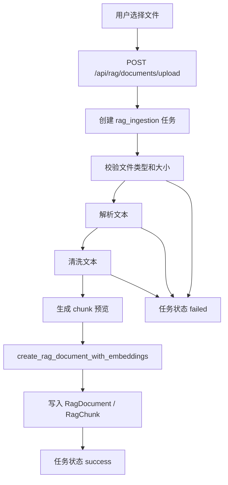

# RAG 文档摄取与任务化 V2 设计文档

更新时间：2026-06-13

## 1. 背景

当前项目的 RAG 已经具备文档管理、metadata、BM25、embedding、hybrid search、rerank、query rewrite、命中日志、质量评估和后台可观测能力。也就是说，“检索侧”已经有阶段性工程化能力。

但当前知识库文档主要依赖用户在前端手动填写标题、内容和 metadata。真实业务里的 RAG 不会只让运营手动粘贴文本，而是要支持文件进入系统后的完整摄取链路：

```text
文件上传
-> 文本解析
-> 文本清洗
-> chunk 切分
-> metadata 补全
-> 入库任务状态记录
-> 失败可追踪
-> 最终进入现有 RAG 检索链路
```

本阶段目标不是重写检索算法，而是补齐 RAG 的“文档入口”和“任务化入库”能力，让项目更接近真实 AI 应用工程。

## 2. 本阶段目标

本阶段建设 **RAG Document Ingestion V2**，核心目标：

1. 支持通过接口上传知识库文件。
2. 支持 `.txt`、`.md`、`.pdf` 的轻量文本解析。
3. 建立统一的文本清洗与 chunk 预处理服务。
4. 建立入库任务状态，记录 pending / running / success / failed。
5. 入库成功后复用现有 `create_rag_document_with_embeddings()` 生成 `RagDocument` 和 `RagChunk`。
6. 前端 Vue3 知识库页面增加“文件导入”入口和任务状态展示。
7. 管理员后台或知识库调试页面能看到导入失败原因，避免黑箱。
8. 写中文学习文档，解释“生产级 RAG 文档摄取链路”。

## 3. 非目标

本阶段不做：

- 不引入 Qdrant / pgvector。
- 不引入 LangChain / LangGraph 新能力。
- 不做 OCR 图片识别。
- 不做 Word / Excel / 网页解析。
- 不做真实 Celery 异步 worker 入库，先用同步执行 + 任务状态抽象，后续可迁移到 Celery。
- 不重写 BM25 / hybrid search / rerank。
- 不做 Docker / Nginx / VPS 上线。
- 不做全站 UI 大改版。

## 4. 设计方案

### 4.1 后端模块

新增或补强以下模块：

```text
backend_python/rag_ingestion.py
```

职责：

- 判断文件类型。
- 校验文件大小和扩展名。
- 从 txt / md / pdf 中提取文本。
- 清洗文本：去掉过多空行、控制字符、重复空格。
- 调用现有 chunk 切分逻辑。
- 生成 ingestion preview，用于测试解析是否正常。

```text
backend_python/routes/rag_documents.py
```

新增接口：

```text
POST /api/rag/documents/upload
GET  /api/rag/documents/ingestion-tasks/{task_id}
```

上传接口返回：

```json
{
  "taskId": "rag_ingestion-xxx",
  "status": "success",
  "document": {},
  "preview": {
    "textLength": 1200,
    "chunkCount": 3,
    "warnings": []
  }
}
```

如果失败，返回任务状态中的错误信息：

```json
{
  "taskId": "rag_ingestion-xxx",
  "status": "failed",
  "error": "Unsupported file type: .docx"
}
```

### 4.2 任务状态

继续复用现有 `backend_python/task_status.py` 的内存任务状态机制。这样做的原因：

- 当前本地开发环境简单。
- 已有 RAG evaluation task 使用同一套结构。
- 未来可以把这层替换成 Redis / Celery，而不影响接口契约。

任务类型：

```text
rag_ingestion
```

任务状态：

```text
pending -> running -> success
pending -> running -> failed
```

### 4.3 文件解析边界

支持：

- `.txt`：按 UTF-8 优先解析，失败时给出明确错误。
- `.md`：当作 Markdown 文本解析，保留标题文本。
- `.pdf`：优先使用本地可用 PDF 解析库；如果环境没有依赖，返回明确错误，而不是假装解析成功。

文件大小限制：

```text
默认 5MB
```

原因：本阶段是工程化闭环，不是大文件处理系统。小文件限制能降低内存风险，也方便本地测试。

### 4.4 前端改造

修改 Vue3 知识库页面：

```text
frontend/src/pages/app/KnowledgePage.vue
```

新增“文件导入”区域：

- 选择知识库类型。
- 选择可见性。
- 选择文件。
- 点击导入。
- 显示任务状态、解析预览、错误原因。

补充 API 和 store：

```text
frontend/src/api/knowledge.ts
frontend/src/stores/knowledge.ts
```

新增方法：

```text
uploadKnowledgeFile(formData)
loadIngestionTask(taskId)
```

### 4.5 可观测性

本阶段的可观测性重点不是“检索命中”，而是“入库前发生了什么”：

- 文件名。
- 文件类型。
- 解析文本长度。
- chunk 数量。
- 清洗告警。
- 失败原因。
- 最终 documentId。

这些信息会进入任务 result，方便前端展示和后端排查。

## 5. 数据流



## 6. 测试策略

后端测试优先：

- txt 文件上传成功并创建 RAG 文档。
- md 文件上传成功并保留标题内容。
- 不支持的文件类型返回失败状态。
- 空文件或解析后空文本失败。
- 文件大小超过限制失败。
- 任务状态接口能查询成功和失败状态。

前端测试：

- 知识库页面渲染文件导入区域。
- 选择文件后调用 upload API。
- 成功时展示 documentId、chunkCount、textLength。
- 失败时展示错误原因。

验收命令：

```powershell
python -m pytest tests/test_rag_document_ingestion.py tests/test_rag_documents_upload_route.py -q
cd frontend
npm.cmd run test -- src/api/knowledge.test.ts src/stores/knowledge.test.ts src/pages/app/knowledge-page.test.ts
npm.cmd run test
npm.cmd run build
```

## 7. 面试表达

这一阶段完成后，可以这样讲：

```text
我没有只做一个能查的 RAG，而是补了文档摄取链路。用户上传文件后，后端会先做类型和大小校验，再解析文本、清洗文本、生成 chunk 预览，然后复用已有的 embedding 入库逻辑写入 RagDocument 和 RagChunk。整个过程有 ingestion task 状态记录，失败时能看到失败原因，成功时能看到文本长度、chunk 数量和 documentId。这个设计未来可以平滑迁移到 Celery 异步任务。
```

## 8. 风险与取舍

- 当前任务状态仍是内存态，服务重启会丢失任务记录。这个问题后续可通过 Redis / 数据库任务表解决。
- PDF 解析依赖本地环境，如果依赖缺失，本阶段选择明确失败，而不是悄悄返回空文本。
- 本阶段先做小文件同步导入，保证链路可讲、可测、可演示；大文件异步处理留到后续 Celery 深化阶段。

## 9. 完成标准

- active plan 中所有任务完成。
- 后端新增测试通过。
- 前端知识库页面能上传 txt / md 文件。
- 不支持文件类型能显示明确错误。
- 上传成功后文档能出现在现有知识库列表里。
- 文档详情能看到 chunks。
- 学习文档完成。
- `docs/roadmap/current-state.md` 更新进度。
- 完成后本 spec 和对应 plan 移动到 completed。
