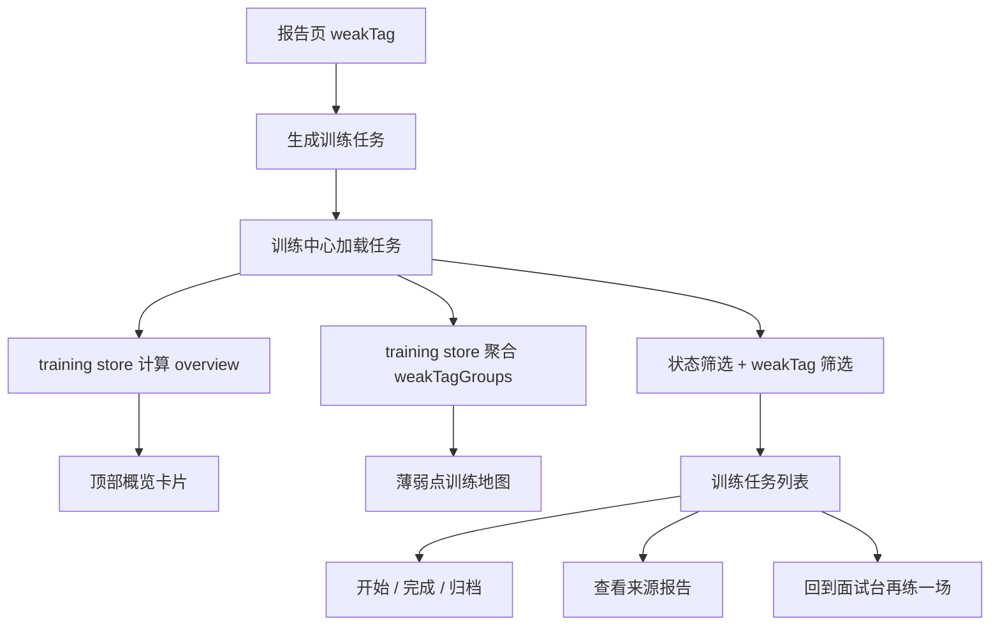

# Training Center V2 设计文档

更新时间：2026-06-13

## 1. 背景

Interview Workbench Experience V4 已经把面试页和报告页串成了更清晰的训练闭环：

```text
面试前配置
-> 面试问答与进度反馈
-> 结束并复盘
-> 报告页建议优先训练
-> 再来一场
```

但当前训练中心仍偏“任务列表页”。它能展示训练任务，也能开始、完成、归档任务，但用户还不够容易理解：

- 我现在最该练哪个薄弱点。
- 每个 weakTag 下有多少任务。
- 哪些任务还没开始，哪些正在练，哪些已经完成。
- 这些训练任务来自哪一次面试报告。
- 练完之后如何回到面试页继续验证提升效果。

因此，本阶段建设 **Training Center V2：专项训练中心产品化**。它的目标不是重写训练后端，而是把已有训练任务组织成更像正式产品的训练工作台。

## 2. 本阶段目标

本阶段目标是让训练中心承接 V4 闭环，形成：

```text
报告 weakTag
-> 训练任务
-> 专项训练中心
-> 完成 / 归档 / 查看来源报告
-> 回到面试页再验证
```

具体目标：

1. 增强训练中心顶部概览，展示待训练、训练中、已完成、已归档、平均掌握度。
2. 按 weakTag 聚合训练任务，展示每个薄弱点的任务数、最高优先级和平均掌握度。
3. 增加状态筛选：全部 / 待训练 / 训练中 / 已完成 / 已归档。
4. 保留当前来源报告筛选和 weakTag query 筛选能力。
5. 强化任务卡片表达：来源报告、优先级、掌握度、尝试次数、下次复习时间。
6. 增加“回到面试台再练一场”入口。
7. 增加中文学习文档，解释训练中心如何承接报告闭环。

## 3. 非目标

本阶段不做：

- 不新增或重写训练后端 API。
- 不重写训练任务生成算法。
- 不重写 weakTag 模板系统。
- 不修改 RAG / Agent / LangGraph 主流程。
- 不做 LangGraph runtime 切换。
- 不做 Docker / Nginx / VPS 上线。
- 不做全站 UI 彻底重构。
- 不做复杂学习日历、提醒系统或付费训练计划。

## 4. 产品设计

### 4.1 顶部训练概览

训练中心顶部从简单统计升级为训练概览：

```text
待训练 3
训练中 1
已完成 5
已归档 2
平均掌握度 62
```

平均掌握度来自当前任务列表的 `masteryScore`：

```text
averageMastery = round(sum(masteryScore) / taskCount)
```

当没有训练任务时，平均掌握度展示为 `--`。

### 4.2 weakTag 训练分组

新增“薄弱点训练地图”：

```text
agent_tool_calling
3 个任务 / 高优先级 / 平均掌握度 45

rag_quality
2 个任务 / 中优先级 / 平均掌握度 58
```

点击某个 weakTag 后，训练任务列表只展示该 weakTag 对应任务。这个筛选只在前端 store 层完成，不新增 API。

### 4.3 状态筛选

训练中心增加状态筛选：

```text
全部 / 待训练 / 训练中 / 已完成 / 已归档
```

对应任务状态：

```text
all
todo
in_progress
done
archived
```

状态筛选与现有 weakTag、sourceInterviewRecordId 筛选叠加。

### 4.4 任务卡片增强

当前任务卡片已有标题、描述、掌握度、来源报告和操作按钮。本阶段增强：

- 优先级：高 / 中 / 低。
- 尝试次数。
- 下次复习时间。
- 状态标签。
- 来源报告跳转。
- 针对已完成任务，操作按钮更克制，避免重复点击造成困惑。

### 4.5 空状态

当没有训练任务时，文案不只说“暂无训练任务”，而是引导用户：

```text
先完成一次模拟面试
-> 在报告页点击生成专项训练任务
-> 回到训练中心查看 weakTag 训练计划
```

并提供入口：

- 去开始面试。
- 去历史复盘。

## 5. 前端架构设计

优先新增小组件，避免继续膨胀 `TrainingPage.vue`。

建议新增：

```text
frontend/src/components/training/TrainingOverviewCards.vue
frontend/src/components/training/TrainingWeakTagMap.vue
frontend/src/components/training/TrainingStatusFilter.vue
```

继续复用：

```text
frontend/src/components/training/TrainingTaskList.vue
```

更新：

```text
frontend/src/stores/training.ts
frontend/src/pages/app/TrainingPage.vue
frontend/src/pages/app/training-page.test.ts
```

store 新增 computed：

```text
todoTasks
inProgressTasks
doneTasks
averageMastery
weakTagGroups
statusFilter
filteredTasks
```

store 新增 action：

```text
setStatusFilter()
setWeakTagFilter()
clearFilters()
```

## 6. 数据流



## 7. 测试策略

本阶段继续遵循前端 TDD：

1. 先写或更新 Vitest 测试。
2. 跑测试确认失败。
3. 再实现 store / 组件 / 页面。
4. 最后跑聚焦测试、全量测试、build 和浏览器验证。

需要覆盖：

- `training store` 能计算状态数量、平均掌握度、weakTagGroups。
- `training store` 能叠加 status、weakTag、sourceInterviewRecordId 筛选。
- `TrainingOverviewCards` 能展示任务概览。
- `TrainingWeakTagMap` 能展示 weakTag 分组并触发筛选。
- `TrainingStatusFilter` 能切换状态筛选。
- `TrainingPage` 能组合概览、weakTag 地图、状态筛选和任务列表。
- 空状态能引导去面试页和历史复盘页。

验收命令：

```powershell
cd frontend
npm.cmd run test -- src/stores/training.test.ts src/components/training/TrainingOverviewCards.test.ts src/components/training/TrainingWeakTagMap.test.ts src/components/training/TrainingStatusFilter.test.ts src/pages/app/training-page.test.ts
npm.cmd run test
npm.cmd run build
```

浏览器验收：

```text
http://127.0.0.1:5173/vue/app/training
http://127.0.0.1:5173/vue/app/training?recordId=<recordId>&weakTag=<weakTag>
```

检查：

- 桌面端无横向溢出。
- 移动端 390px 无横向溢出。
- 顶部概览卡片可见。
- weakTag 训练地图可见。
- 状态筛选可用。
- 任务列表能按筛选变化。
- 来源报告跳转可用。
- 回到面试台入口可用。
- 页面不出现 `undefined`。

## 8. 与 LangGraph 深化的关系

Training Center V2 不直接做 LangGraph，但它会让后续 LangGraph 深化更有价值。

原因是：

```text
训练中心负责沉淀用户薄弱点和训练任务
LangGraph 未来可以读取这些训练状态
再决定下一场面试要不要优先追问对应 weakTag
```

后续可单独规划：

```text
LangGraph Runtime Switch V4
```

目标是支持：

```text
classic
langgraph
shadow compare
```

但这应作为独立阶段，不和 Training Center V2 混在一起，避免一次性改动过大。

## 9. 面试表达

完成后可以这样讲：

```text
我把训练中心从普通任务列表升级成专项训练工作台。系统会从面试报告中提取 weakTag，再生成训练任务；训练中心按 weakTag 聚合任务，展示待训练、训练中、已完成、平均掌握度和来源报告。用户可以围绕某个薄弱点持续训练，训练完成后再回到面试台验证提升效果。

这个设计让 AI 面试系统不只是生成报告，而是形成了面试、复盘、训练、再面试的闭环。
```

## 10. 完成标准

- active plan 所有任务完成。
- 训练中心顶部概览完成。
- weakTag 训练地图完成。
- 状态筛选完成。
- 任务卡片表达增强。
- 空状态引导增强。
- 聚焦前端测试通过。
- 前端全量测试通过。
- 前端 build 通过。
- 浏览器完成桌面端和移动端验证。
- 新增中文学习文档。
- `docs/roadmap/current-state.md` 更新。
- 完成后本 spec 和对应 plan 移动到 `completed/`。
